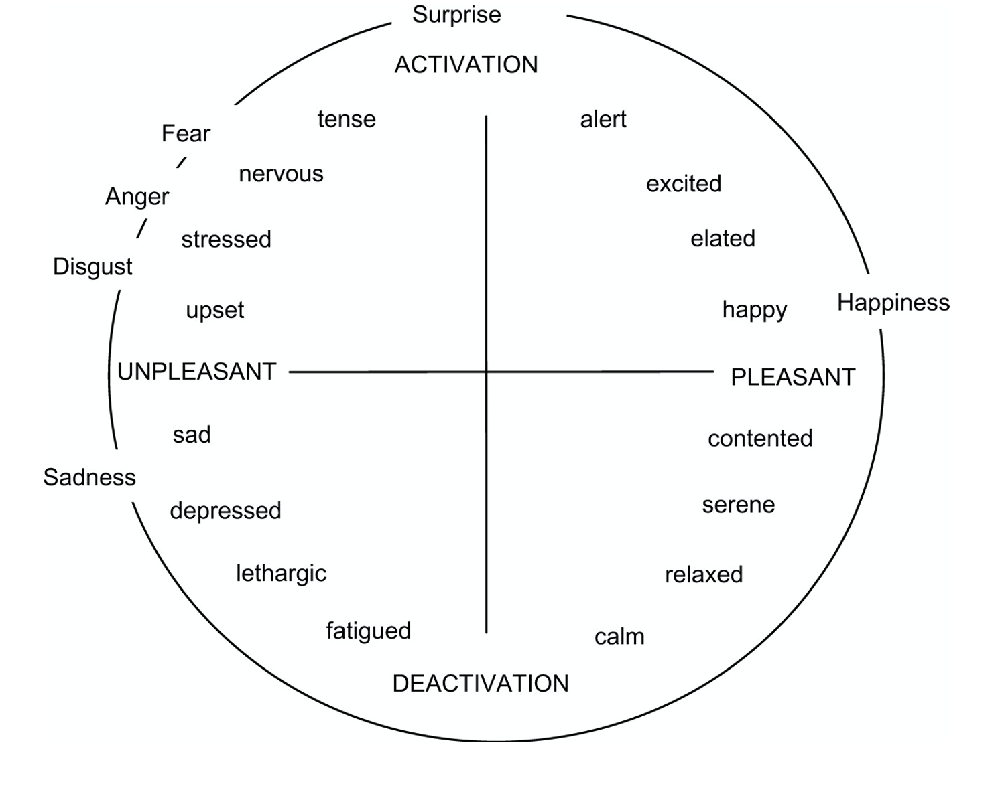
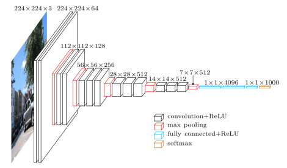
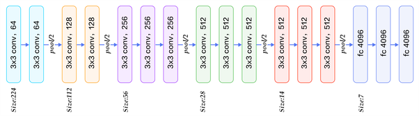
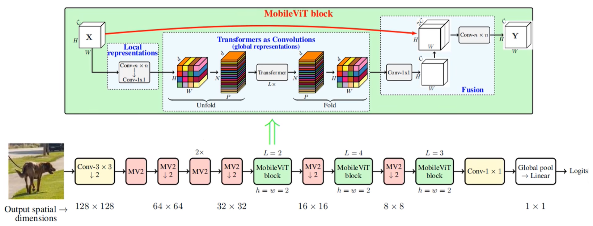
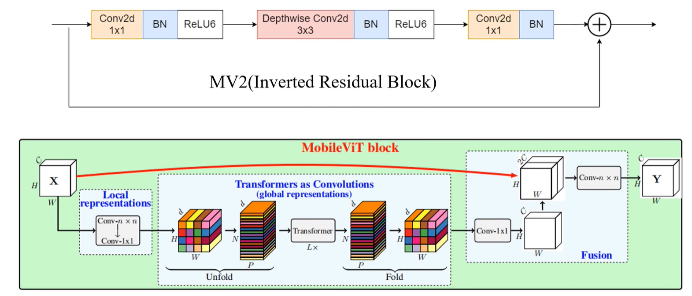
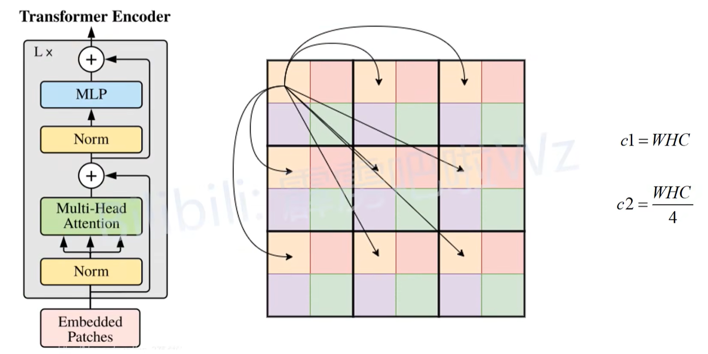

# 模块1：情感计算之人脸表情识别 — 基础知识

---

## 目录

1. [什么是 FER（人脸表情识别）](#1-什么是-fer人脸表情识别)
2. [心理学理论基础](#2-心理学理论基础)
3. [七种基本表情](#3-七种基本表情)
4. [人脸动作编码系统（FACS）](#4-人脸动作编码系统facs)
5. [深度学习 CNN 模型体系](#5-深度学习-cnn-模型体系)
   - [5.1 VGG](#51-vgg)
   - [5.2 ResNet](#52-resnet)
   - [5.3 MobileNet](#53-mobilenet)
   - [5.4 MobileViT](#54-mobilevit)
6. [FER-2013 数据集](#6-fer-2013-数据集)
7. [Python 模型训练基础](#7-python-模型训练基础)
8. [模型训练流程](#8-模型训练流程)
9. [模型评估](#9-模型评估)
10. [ONNX 模型格式](#10-onnx-模型格式)
11. [RESTful 接口与规范](#11-restful-接口与规范)
12. [Flask Web 前端框架](#12-flask-web-前端框架)

---

## 1. 什么是 FER（人脸表情识别）

### 1.1 定义

**人脸表情识别**（Facial Expression Recognition, FER）是计算机视觉与情感计算交叉领域的一项核心技术，旨在通过分析人脸图像或视频，自动识别出人类的面部表情所对应的情感状态。它是人工智能"理解人类情感"的关键能力之一，也是情感计算（Affective Computing）领域中最活跃的研究方向。

### 1.2 技术范畴

FER 属于以下领域的交叉：

```
┌─────────────────────────────────────────────────┐
│                  情感计算                        │
│           (Affective Computing)                  │
│    ┌──────────────┐    ┌──────────────────┐      │
│    │  人脸表情识别  │    │  语音情感识别      │      │
│    │    (FER)      │    │  (SER)            │      │
│    └──────┬───────┘    └──────────────────┘      │
│           │                                      │
│    ┌──────┴───────┐    ┌──────────────────┐      │
│    │  计算机视觉    │    │  深度学习          │      │
│    │ (Computer     │◄──►│  (Deep Learning)  │      │
│    │  Vision)      │    │                   │      │
│    └──────────────┘    └──────────────────┘      │
└─────────────────────────────────────────────────┘
```

### 1.3 FER 的基本流程

一个完整的 FER 系统通常包含以下步骤：

```
输入图像/视频
    │
    ▼
[人脸检测]        ← 定位图像中的人脸位置
    │
    ▼
[人脸对齐/预处理]  ← 裁剪、旋转归一化、尺寸统一
    │
    ▼
[特征提取]        ← CNN/Transformer 提取表情特征
    │
    ▼
[表情分类]        ← Softmax 输出7类表情概率
    │
    ▼
输出：表情类别 + 置信度
```

### 1.4 FER 的应用场景

| 场景 | 应用示例 |
|:---|:---|
| **人机交互（HCI）** | 智能机器人理解用户情绪，自适应调整交互策略 |
| **教育** | 在线课堂监测学生专注度和情绪状态，辅助教学质量评估 |
| **医疗健康** | 辅助抑郁症、自闭症等精神疾病的早期筛查与监测 |
| **驾驶安全** | 监测驾驶员疲劳、愤怒等危险情绪状态 |
| **市场调研** | 分析消费者对产品/广告的真实情感反应 |
| **安全监控** | 公共场所异常情绪行为预警 |

### 1.5 FER 的发展历程

| 阶段 | 年代 | 主要方法 | 代表性工作 |
|:---|:---|:---|:---|
| 萌芽期 | 1970s~1990s | 几何特征、模板匹配 | Ekman 的 FACS 系统 |
| 传统方法期 | 2000s~2012 | 手工特征（LBP、HOG、Gabor）+ SVM | CK+ 数据集研究 |
| 深度学习期 | 2013~2020 | CNN（VGG、ResNet）端到端学习 | FER-2013 挑战赛 |
| 现代前沿期 | 2020~至今 | Transformer、ViT、多模态融合 | MobileViT、MAE-FER |

---

## 2. 心理学理论基础

### 2.1 情绪分类理论

情绪分类理论是 FER 的心理学根基。主要有两种互相对立的观点：

#### （1）基本情绪理论（Basic Emotion Theory）

**代表人物**：Paul Ekman（保罗·艾克曼）

**核心观点**：
- 存在一组**跨文化、与生俱来**的基本情绪
- 每种基本情绪对应特定的、可识别的面部表情模式
- 这些表情模式具有**跨文化一致性**——无论人种、地域、文化背景，同一种基本情绪的面部表达是相似的

**Ekman 的经典研究**：
- 1971 年对新几内亚 Fore 部落的研究：该部落与外界几乎隔绝，但部落成员仍能准确识别西方人照片中的情绪表情，反之亦然
- 这被认为是基本情绪具有生物学基础的强有力证据

**六种基本情绪**（Ekman 1972）：
1. 愤怒（Anger）
2. 厌恶（Disgust）
3. 恐惧（Fear）
4. 快乐（Happiness）
5. 悲伤（Sadness）
6. 惊讶（Surprise）

> 后续研究中，Ekman 扩展并纳入了更多候选基本情绪，包括"轻蔑（Contempt）"等。FER-2013 中采用的就是包含 **中性（Neutral）** 在内的 7 分类体系。

#### （2）维度情绪理论（Dimensional Emotion Theory）

**核心观点**：情绪不是离散的类别，而是在连续维度上变化。

**两种主流维度模型**：

| 模型 | 维度 | 说明 |
|:---|:---|:---|
| **效价-唤醒模型**（Russell, 1980） | 效价（Valence）：愉快↔不愉快 | 2D 环形模型（Circumplex Model） |
| | 唤醒（Arousal）：激活↔平静 | |
| **PAD 三维模型**（Mehrabian & Russell, 1974） | 愉悦度（Pleasure） | 3D 空间定位任意情绪 |
| | 唤醒度（Arousal） | |
| | 支配度（Dominance） | |

**两种理论的关系**：

```
效价 (Valence)
    ↑ 高唤醒 + 负效价          高唤醒 + 正效价
    │   (恐惧、愤怒)              (兴奋、快乐)
    │
    │           ●愤怒    ●惊讶
    │     ●恐惧           ●快乐
    │  ●厌恶
    │           ●悲伤  ●中性
    │
    └──────────────────────────→ 唤醒 (Arousal)
    低唤醒 + 负效价          低唤醒 + 正效价
```

> **提示**：基本情绪理论（离散类别）是 FER 分类任务的理论基础，也是 FER-2013 数据集标注的依据。



*图：Russell (1980) 的环形情感模型（Circumplex Model of Affect）。横轴为效价（Valence：不愉快↔愉快），纵轴为唤醒度（Arousal：低激活↔高激活），所有情绪分布在二维环形空间中。图片来源：Psychology of Human Emotion (CC BY-NC-SA 4.0)*

### 2.2 表情的神经基础

现代神经科学研究揭示了面部表情加工的神经环路：

| 脑区 | 功能 |
|:---|:---|
| **杏仁核（Amygdala）** | 恐惧表情的核心处理区域；快速、自动的情绪检测 |
| **梭状回面孔区（FFA）** | 面孔身份识别，参与表情的精细加工 |
| **颞上沟（STS）** | 处理动态面部运动（如视线方向、嘴部动作） |
| **前额叶皮层（PFC）** | 情绪调节与认知再评估 |
| **岛叶（Insula）** | 厌恶情绪的核心处理区域 |
| **镜像神经元系统** | 共情：看到他人表情时自动模拟对应的肌肉运动 |

---

## 3. 七种基本表情

### 3.1 表情总览

FER-2013 采用的 7 分类标签体系：

| 索引 | 中文 | 英文　　 | 代码　　　 |
| :----:| :-----| :---------| :-----------|
| 0　　| 愤怒 | Angry　　| `angry`　　|
| 1　　| 厌恶 | Disgust　| `disgust`　|
| 2　　| 恐惧 | Fear　　 | `fear`　　 |
| 3　　| 快乐 | Happy　　| `happy`　　|
| 4　　| 悲伤 | Sad　　　| `sad`　　　|
| 5　　| 惊讶 | Surprise | `surprise` |
| 6　　| 中性 | Neutral　| `neutral`　|

### 3.2 各表情的面部特征详解

#### ① 愤怒（Angry）

| 面部区域 | 特征 |
|:---|:---|
| 眉毛 | 压低并聚拢（眉头紧锁） |
| 眼睛 | 瞪大或眯起，目光锐利 |
| 嘴巴 | 嘴唇紧闭（抿嘴）或张开露齿 |
| 其他 | 鼻孔可能扩张，下巴紧绷 |

> 关键动作单元：AU4（降眉）+ AU5（上睑提）+ AU7（眼轮匝肌收紧）+ AU23（唇收紧）

#### ② 厌恶（Disgust）

| 面部区域 | 特征 |
|:---|:---|
| 眉毛 | 压低 |
| 眼睛 | 眯起或变窄 |
| 鼻子 | **鼻梁起皱褶（最具标志性特征）** |
| 嘴巴 | 上唇抬起，可能呈倒U形 |

> 关键动作单元：AU9（皱鼻）+ AU10（上唇提）+ AU4（降眉）

#### ③ 恐惧（Fear）

| 面部区域 | 特征 |
|:---|:---|
| 眉毛 | 抬起并聚拢 |
| 眼睛 | **睁大（眼白露出）**——最具标志性 |
| 嘴巴 | 张开，嘴唇可能向后拉 |

> 关键动作单元：AU1（内眉抬）+ AU2（外眉抬）+ AU4（降眉）+ AU5（上睑提）+ AU20（唇拉伸）+ AU26（下颌下降）

#### ④ 快乐（Happy）

| 面部区域 | 特征 |
|:---|:---|
| 眉毛 | 自然或微微下垂 |
| 眼睛 | **眼角出现鱼尾纹（Duchenne 标志）** |
| 嘴巴 | **嘴角上扬（微笑）**，可能露齿 |
| 脸颊 | 抬高 |

> 关键动作单元：AU6（脸颊提）+ AU12（嘴角拉伸）
>
> 🔬 **Duchenne 微笑 vs 社交微笑**：真正的快乐微笑（Duchenne 微笑）伴随眼轮匝肌（AU6）的收缩，产生眼角鱼尾纹；而社交性微笑仅有嘴角上扬（AU12），不涉及眼部。

#### ⑤ 悲伤（Sad）

| 面部区域 | 特征 |
|:---|:---|
| 眉毛 | 内侧抬起（眉头微微上翘） |
| 眼睛 | 可能微微下垂 |
| 嘴巴 | **嘴角下垂**——最具标志性 |

> 关键动作单元：AU1（内眉抬）+ AU4（降眉）+ AU15（嘴角下压）+ AU17（颏提肌）

#### ⑥ 惊讶（Surprise）

| 面部区域 | 特征 |
|:---|:---|
| 眉毛 | **高高抬起呈弓形**——最具标志性 |
| 眼睛 | **睁大**，上眼睑抬起 |
| 嘴巴 | 自然张开（下颌向下） |

> 关键动作单元：AU1+AU2（内外眉抬）+ AU5（上睑提）+ AU26（下颌下降）

#### ⑦ 中性（Neutral）

| 面部区域 | 特征 |
|:---|:---|
| 眉毛 | 自然平直 |
| 眼睛 | 正常睁开 |
| 嘴巴 | 自然闭合 |

> 所有面部肌肉处于放松或自然张力状态，无明显表情特征。

### 3.3 常见混淆模式

在 FER 任务中，以下几对表情是最容易混淆的：

| 混淆对 | 原因分析 | 区分关键 |
|:---|:---|:---|
| **恐惧 ↔ 惊讶** | 都涉及眉毛抬起 + 眼睛睁大 + 嘴巴张开 | 恐惧：眉毛聚拢；惊讶：眉毛弓形分离 |
| **愤怒 ↔ 厌恶** | 都涉及眉毛压低 | 厌恶有鼻梁皱褶（AU9），愤怒有嘴唇紧闭 |
| **悲伤 ↔ 中性** | 悲伤强度弱时面度变化细微 | 悲伤有眉头内侧微翘（AU1） |
| **恐惧 ↔ 悲伤** | 都有眉头内侧抬起 | 恐惧眼睛睁大，悲伤眼睛下垂 |

---

## 4. 人脸动作编码系统（FACS）

### 4.1 什么是 FACS

**人脸动作编码系统**（Facial Action Coding System, FACS）由 Paul Ekman 和 Wallace V. Friesen 于 1978 年开发，是一套**基于解剖学的、系统化描述面部肌肉运动的编码体系**。

> **核心理念**：任何面部表情都可以分解为若干基本**动作单元（Action Unit, AU）** 的组合。

### 4.2 动作单元（Action Unit, AU）

每个 AU 对应一块或一组面部肌肉的收缩。FACS 定义了 46 个主要的 AU：

**上半脸主要 AU（眉毛+额头+眼睛）**：

| AU编号 | 名称 | 肌肉 | 示例情绪 |
|:---|:---|:---|:---|
| AU1 | 内侧眉毛抬起 | 额肌（内侧） | 悲伤、恐惧 |
| AU2 | 外侧眉毛抬起 | 额肌（外侧） | 惊讶、恐惧 |
| AU4 | 眉毛压低 | 降眉肌、皱眉肌 | 愤怒、厌恶 |
| AU5 | 上眼睑抬起 | 上睑提肌 | 恐惧、惊讶 |
| AU6 | 脸颊抬起 | 眼轮匝肌 | 快乐 |
| AU7 | 眼睑收紧 | 眼轮匝肌 | 愤怒 |
| AU9 | 鼻子皱起 | 鼻肌 | **厌恶（核心标志）** |

**下半脸主要 AU（嘴巴+下巴+鼻子）**：

| AU编号 | 名称 | 肌肉 | 示例情绪 |
|:---|:---|:---|:---|
| AU10 | 上唇抬起 | 上唇提肌 | 厌恶 |
| AU12 | 嘴角拉伸 | 颧大肌 | **快乐（核心标志）** |
| AU15 | 嘴角下压 | 降口角肌 | **悲伤（核心标志）** |
| AU17 | 下巴抬起 | 颏提肌 | 悲伤 |
| AU20 | 嘴唇拉伸 | 笑肌 | 恐惧 |
| AU23 | 嘴唇收紧 | 口轮匝肌 | 愤怒 |
| AU25 | 双唇分开 | 降下唇肌 | 惊讶、恐惧 |
| AU26 | 下颌下降 | 下颌肌群 | 惊讶、恐惧 |

### 4.3 FACS 与七种表情的映射

```
愤怒 (Angry)   = AU4 + AU5 + AU7 + AU23
厌恶 (Disgust)  = AU4 + AU9 + AU10
恐惧 (Fear)     = AU1 + AU2 + AU4 + AU5 + AU20 + AU26
快乐 (Happy)    = AU6 + AU12
悲伤 (Sad)      = AU1 + AU4 + AU15 + AU17
惊讶 (Surprise) = AU1 + AU2 + AU5 + AU26
中性 (Neutral)  = 无显著 AU（基线状态）
```

### 4.4 FACS 在 FER 中的意义

- **提供可解释性**：模型的预测结果可以通过 AU 验证——如果模型判断为"快乐"，应同时检测到 AU6+AU12 的激活
- **辅助数据标注**：为标注人员提供客观依据，提高标注一致性
- **AU 检测任务**：一些研究直接从图像中检测 AU，再映射到情绪，这是一个相对更客观的路径

> 📸 **FACS 动作单元可视化参考**：完整的 FACS AU 图示可参阅 [iMotions FACS Visual Guidebook](https://imotions.com/blog/learning/research-fundamentals/facial-action-coding-system/) 或 [Melinda Ozel's FACS Cheat Sheet](https://melindaozel.com/facs-cheat-sheet/)。七种基本表情的真实面孔示例可参考 [Paul Ekman's Universal Facial Expressions](https://www.paulekman.com/resources/universal-facial-expressions/) 或 [Science of People Microexpressions Guide](https://www.scienceofpeople.com/microexpressions/)。

---

## 5. 深度学习 CNN 模型体系

从 2014 年到 2022 年，CNN 模型经历了从"更深更宽"到"更轻更智能"的演进。本课程选择了四个具有代际代表性的模型。

### 5.0 四代模型演进

```
2014 ──── VGG ──── 简单层叠，追求深度
  │
2015 ──── ResNet ──── 残差连接，突破深度瓶颈
  │
2019 ──── MobileNetV3 ──── 深度可分离卷积 + NAS，极致轻量
  │
2022 ──── MobileViT ──── CNN + Transformer 混合，轻量+全局感受
```

---

### 5.1 VGG

#### 简介

VGG（Visual Geometry Group）由牛津大学 **Visual Geometry Group** 实验室于 2014 年提出，是 CNN 发展史上的里程碑之一。它的核心理念是：**用更深的小卷积核（3×3）替代浅层的大卷积核，在保证感受野相同的前提下增加网络深度和非线性表达能力**。

#### 发布信息

| 项目 | 内容 |
|:---|:---|
| **论文** | *Very Deep Convolutional Networks for Large-Scale Image Recognition* |
| **发布者** | Karen Simonyan, Andrew Zisserman |
| **机构** | 牛津大学 Visual Geometry Group |
| **年代** | 2014 |
| **会议** | ICLR 2015 |
| **ImageNet Top-5 错误率** | 7.3%（VGG-16） |

#### 核心设计思想

```
大卷积核思路：         7×7 Conv                         → 感受野=7×7
                      
VGG 思路（3个3×3）：   3×3 → 3×3 → 3×3 Conv            → 感受野=7×7

相同感受野，但 VGG 优势：
- 更多非线性层（3个ReLU vs 1个ReLU）
- 参数量更少（3×3²×C² = 27C² vs 7×7²×C² = 49C²）
- 正则化效果更好
```

#### VGG-16 网络结构

```
输入: [3, 224, 224]  RGB 图像
    │
    ├─ Conv Block 1: Conv3-64 → Conv3-64 → MaxPool
    │  输出: [64, 112, 112]
    │
    ├─ Conv Block 2: Conv3-128 → Conv3-128 → MaxPool
    │  输出: [128, 56, 56]
    │
    ├─ Conv Block 3: Conv3-256 → Conv3-256 → Conv3-256 → MaxPool
    │  输出: [256, 28, 28]
    │
    ├─ Conv Block 4: Conv3-512 → Conv3-512 → Conv3-512 → MaxPool
    │  输出: [512, 14, 14]
    │
    ├─ Conv Block 5: Conv3-512 → Conv3-512 → Conv3-512 → MaxPool
    │  输出: [512, 7, 7]
    │
    ├─ Flatten
    │
    ├─ FC-4096 → ReLU → Dropout(0.5)
    ├─ FC-4096 → ReLU → Dropout(0.5)
    ├─ FC-1000 (ImageNet)
    │
    └─ 替换为 FC-7 (FER 任务)
```

**VGG 系列变体**：

| 变体 | 层数 | 参数量 |
|:---|:---|:---|
| VGG-11 | 11 | ~133M |
| VGG-13 | 13 | ~134M |
| **VGG-16** | 16 | **~138M** |
| VGG-19 | 19 | ~144M |



*图：VGG-16 整体架构。输入为 224×224×3 的 RGB 图像，经 5 组卷积块（蓝色）与最大池化（红色）逐步提取特征，最后经 3 层全连接（绿色）输出 1000 类分类（FER 任务中替换为 7 类）。图片来源：OpenGenus IQ*



*图：VGG-16 逐层结构图，展示了每层的输入/输出尺寸、卷积核大小和通道数变化。图片来源：OpenGenus IQ*

#### 优缺点

| 优点 | 缺点 |
|:---|:---|
| 结构简单、易于理解 | 参数量极大（~138M），训练和推理都很慢 |
| 良好的特征提取能力 | 全连接层占大量参数 |
| 适合作为 Baseline | 没有使用 Batch Normalization（原始版本） |
| 迁移学习效果好 | 梯度消失问题限制了进一步加深 |

#### 在 FER 项目中的使用

```python
from src.models.factory import create_fer_model

model = create_fer_model(
    model_type='vgg',
    model_name='vgg16',
    num_classes=7,
    pretrained=True,
    dropout_rate=0.2
)
```

> 配置文件中 `batch_size` 设为 16（较小），因为 VGG 参数量大，显存占用高。

---

### 5.2 ResNet

#### 简介

**ResNet**（Residual Network，残差网络）由微软研究院的 **Kaiming He（何恺明）** 等人于 2015 年提出，解决了深层网络训练中的**退化问题**（Degradation Problem）——当网络加深到一定程度后，准确率不升反降。

核心创新是 **残差连接（Residual Connection / Skip Connection）**，该思想影响深远，几乎成为后续所有深度网络的标准组件。

#### 发布信息

| 项目 | 内容 |
|:---|:---|
| **论文** | *Deep Residual Learning for Image Recognition* |
| **发布者** | Kaiming He, Xiangyu Zhang, Shaoqing Ren, Jian Sun |
| **机构** | 微软研究院（Microsoft Research） |
| **年代** | 2015 |
| **会议** | CVPR 2016（Best Paper） |
| **ImageNet Top-5 错误率** | 3.57%（ResNet-152，首次超越人类水平） |

#### 残差连接原理

```
传统网络：                        ResNet 残差块：
                                  
输入 x                             输入 x
  │                                  │
  ▼                                  ├────────────────┐
Weight Layer                         ▼                │
  │                              Weight Layer         │
  ▼                                  │                │
ReLU                                ▼                │
  │                              Weight Layer         │
  ▼                                  │                │
Weight Layer                        ▼                │
  │                              F(x) + x ◄──────────┘  ← 跳跃连接
  ▼                                  │
ReLU                                ▼
  │                              ReLU
  ▼
H(x) ← 直接学习目标映射           H(x) = F(x) + x ← 学习残差映射

问题：梯度消失导致难以训练       F(x) = H(x) - x → 只需学习"变化量"
                                    梯度通过跳跃连接直传，缓解梯度消失
```

**为何有效**：
- 如果恒等映射（identity）已经是最优解，只需让 F(x) → 0（让权重趋向 0），比让多层非线性层去拟合恒等映射容易得多
- 梯度可以通过跳跃连接直接传回浅层，缓解梯度消失
- 实现了隐式的"深层监督"


*图：左为普通卷积块（无跳跃连接），信息逐层传递，深层梯度容易消失；右为残差块，通过跳跃连接（Shortcut/Skip Connection）将输入 x 直连到输出，只需学习残差 F(x) = H(x) - x。图片来源：Dive into Deep Learning (d2l.ai)*


*图：ResNet-50 中使用的 Bottleneck 残差块。左为常规残差块（两个 3×3 卷积），右为 Bottleneck 设计（1×1 降维 → 3×3 卷积 → 1×1 升维），大幅减少参数量。图片来源：Dive into Deep Learning (d2l.ai)*

#### ResNet-50 网络结构

ResNet-50 使用 **Bottleneck 残差块**：

```
输入: [3, 224, 224]
    │
    ├─ Conv1: 7×7, 64, stride=2 → BN → ReLU → MaxPool
    │  输出: [64, 56, 56]
    │
    ├─ Conv2_x: 3个 Bottleneck [1×1,64→3×3,64→1×1,256]
    │  输出: [256, 56, 56]
    │
    ├─ Conv3_x: 4个 Bottleneck [1×1,128→3×3,128→1×1,512]
    │  输出: [512, 28, 28]
    │
    ├─ Conv4_x: 6个 Bottleneck [1×1,256→3×3,256→1×1,1024]
    │  输出: [1024, 14, 14]
    │
    ├─ Conv5_x: 3个 Bottleneck [1×1,512→3×3,512→1×1,2048]
    │  输出: [2048, 7, 7]
    │
    ├─ Average Pooling
    └─ FC-7 (FER 任务)
```

**Bottleneck 块详解**：

```
输入: 256-d
  │
  ├─ 1×1 Conv, 64  → BN → ReLU    ← 降维：256→64
  ├─ 3×3 Conv, 64  → BN → ReLU    ← 核心卷积
  ├─ 1×1 Conv, 256 → BN           ← 升维：64→256（与输入维度匹配）
  │
  └─ + shortcut (256-d) → ReLU

三层结构：降维 → 卷积 → 升维，大幅减少参数量
```

**ResNet 系列变体**：

| 变体 | 层数 | 参数量 | 残差块类型 |
|:---|:---|:---|:---|
| ResNet-18 | 18 | ~11M | Basic Block |
| ResNet-34 | 34 | ~21M | Basic Block |
| **ResNet-50** | 50 | **~25M** | Bottleneck |
| ResNet-101 | 101 | ~44M | Bottleneck |
| ResNet-152 | 152 | ~60M | Bottleneck |

#### 优缺点

| 优点 | 缺点 |
|:---|:---|
| 残差连接解决了深度网络的退化问题 | 比 MobileNet 系列大很多 |
| 迁移学习效果好，是通用视觉任务的标配 Backbone | 推理速度中等问题 |
| Batch Normalization 加速收敛 | 对于移动端部署仍然偏重 |
| **CVPR 2016 最佳论文**，影响力深远 | 感受野受限（纯 CNN 无全局注意力） |

#### 在 FER 项目中的使用

```python
model = create_fer_model(
    model_type='resnet',
    model_name='resnet50',
    num_classes=7,
    pretrained=True,
    dropout_rate=0.2
)
```

> 历史训练中，ResNet-50 在 FER-2013 上达到 **71.26%** 的最佳验证准确率，是本项目中精度最高的模型。

---

### 5.3 MobileNet

#### 简介

**MobileNet** 系列由 Google 团队提出，专为移动端和嵌入式设备设计。核心创新是 **深度可分离卷积（Depthwise Separable Convolution）**，将标准卷积分解为 Depthwise 卷积 + Pointwise 卷积，在保持相近精度的同时大幅减少计算量和参数量。

MobileNetV3 是该系列的集大成者，引入了 **NAS（神经架构搜索）** 和 **SE（Squeeze-and-Excitation）注意力模块**。

#### 发布信息

| 版本 | 论文 | 发布者 | 机构 | 年代 |
|:---|:---|:---|:---|:---|
| MobileNetV1 | *MobileNets: Efficient CNNs for Mobile Vision Applications* | Andrew G. Howard 等 | Google | 2017 |
| MobileNetV2 | *MobileNetV2: Inverted Residuals and Linear Bottlenecks* | Mark Sandler 等 | Google | 2018 |
| MobileNetV3 | *Searching for MobileNetV3* | Andrew Howard 等 | Google | 2019 |

#### 深度可分离卷积原理

```
标准卷积                          深度可分离卷积

输入: D_F×D_F×M                  输入: D_F×D_F×M

  │                                ├─ Depthwise:
  ▼                                  D_K×D_K×M 逐通道卷积
D_K×D_K×M×N                         输出: D_F×D_F×M
  │                                  │
  ▼                                  ▼
输出: D_F×D_F×N                    ├─ Pointwise:
                                    1×1×M×N 逐点卷积
                                    输出: D_F×D_F×N

计算量 = D_K² × M × N × D_F²      计算量 = D_K² × M × D_F² + M × N × D_F²
                                  节省比例 ≈ 1/N + 1/D_K²
                                  例如 3×3 标准卷积被分解后计算量约为原来的 ~1/9
```

> 📊 **深度可分离卷积示意图**：标准卷积 vs 深度可分离卷积的直观对比图可参考 MobileNet 原论文 Figure 2（[arXiv:1704.04861](https://arxiv.org/abs/1704.04861)），或参见 [MobileNet 深度可分离卷积详解 (cnblogs)](https://www.cnblogs.com/sddai/p/14549475.html)。

#### SE（Squeeze-and-Excitation）注意力机制

MobileNetV3 在 bottleneck 结构中集成了 SE 模块：

```
输入
  │
  ├─ 1×1 扩展
  ├─ 3×3 Depthwise
  ├─ Global Average Pooling  ← Squeeze：压缩全局空间信息
  ├─ FC → ReLU               ←
  ├─ FC → Hard-Sigmoid       ←  Excitation：学习通道权重
  ├─ Scale (逐通道加权)
  └─ 1×1 投影
  │
输出
```

#### MobileNetV3-Small 结构概览

| 阶段 | 操作 | 输出通道 | SE | 激活函数 | 步长 |
|:---|:---|:---|:---:|:---|:---:|
| 1 | Conv2d 3×3 | 16 | - | HS | 2 |
| 2 | bneck 3×3 | 16 | ✓ | RE | 2 |
| 3 | bneck 3×3 | 24 | - | RE | 2 |
| 4 | bneck 3×3 | 24 | - | RE | 1 |
| 5 | bneck 5×5 | 40 | ✓ | HS | 2 |
| 6 | bneck 5×5 | 40 | ✓ | HS | 1 |
| 7 | bneck 5×5 | 40 | ✓ | HS | 1 |
| 8 | bneck 5×5 | 48 | ✓ | HS | 1 |
| 9 | bneck 5×5 | 48 | ✓ | HS | 1 |
| 10 | bneck 5×5 | 96 | ✓ | HS | 2 |
| 11 | bneck 5×5 | 96 | ✓ | HS | 1 |
| 12 | bneck 5×5 | 96 | ✓ | HS | 1 |
| 13 | Conv2d 1×1 | 576 | - | HS | 1 |
| 14 | Pool 7×7 | - | - | - | - |
| 15 | Conv2d 1×1 | 1280 | - | HS | 1 |

> HS = Hard-Swish（h-swish）, RE = ReLU

#### MobileNet 系列对比

| 特性 | MobileNetV1 | MobileNetV2 | MobileNetV3-Small | MobileNetV3-Large |
|:---|:---:|:---:|:---:|:---:|
| 核心创新 | 深度可分离卷积 | 倒残差 + Linear Bottleneck | NAS + SE + h-swish | NAS + SE + h-swish |
| 参数量 | ~4.2M | ~3.5M | **~2.5M** | ~5.4M |
| ImageNet Top-1 | 70.6% | 72.0% | 67.4% | 75.2% |
| 设计方式 | 手工 | 手工 | NAS + NetAdapt | NAS + NetAdapt |

#### 优缺点

| 优点 | 缺点 |
|:---|:---|
| **极轻量**：参数量仅 ~2.5M | 绝对精度不如 ResNet-50 |
| 推理速度快，适合移动端/边缘设备 | 对复杂场景的泛化能力有限 |
| NAS 搜索 + 手工优化结合 | 对小目标特征表达能力稍弱 |
| 集成了 SE 注意力模块 | 仅使用局部卷积，缺乏全局感受野 |

#### 在 FER 项目中的使用

```python
model = create_fer_model(
    model_type='mobilenet',
    model_name='mobilenetv3_small',
    num_classes=7,
    pretrained=True,
    dropout_rate=0.2
)
```

> MobileNetV3-Small 在 CPU 上约 2~3 分钟/epoch，是本项目中最适合快速实验的模型。

---

### 5.4 MobileViT

#### 简介

**MobileViT** 由 Apple 团队于 2022 年提出，创新性地将 **CNN 的局部特征提取能力**与 **Transformer 的全局感受野**相结合，专为移动端视觉任务设计。它既能像 CNN 一样高效处理空间局部信息，又能像 ViT（Vision Transformer）一样捕捉长距离依赖关系，是当前轻量级视觉模型的前沿代表。

#### 发布信息

| 项目 | 内容 |
|:---|:---|
| **论文** | *MobileViT: Light-weight, General-purpose, and Mobile-friendly Vision Transformer* |
| **发布者** | Sachin Mehta, Mohammad Rastegari |
| **机构** | Apple |
| **年代** | 2022 |
| **会议** | ICLR 2022 |
| **ImageNet Top-1** | 74.8%（MobileViT-XS，仅 ~2.3M 参数） |

#### CNN + Transformer 混合设计

```
传统 CNN：
  输入 → Conv → Conv → ... → 输出
  局限：感受野受限于卷积核大小，长距离依赖需堆叠多层

纯 ViT：
  输入 → Patch Embedding → Transformer Blocks → 输出
  局限：缺少 CNN 的归纳偏置（局部性、平移不变性），数据需求量大

MobileViT（混合架构）：
  输入 → [CNN 局部编码] → [MobileViT Block（Transformer 全局编码）] → [CNN 融合] → 输出
  优势：CNN 捕获局部细节 + Transformer 建模全局关系，取两者之长
```

#### MobileViT Block 详解

```
输入: [B, C, H, W]
  │
  ├─ 3×3 Conv → 1×1 Conv          ← CNN 局部编码
  │  输出: [B, d, H, W]
  │
  ├─ Unfold → [P, N, d]            ← 展开为 Patches
  │   (P=HW/wh: 分块数, N=wh: 每块像素数)
  │
  ├─ Transformer Encoder            ← 跨 Patch 全局注意力
  │   ├─ Multi-Head Self-Attention
  │   └─ Feed-Forward Network
  │
  ├─ Fold → [B, d, H, W]           ← 折回空间维度
  │
  ├─ 1×1 Conv → 3×3 Conv          ← CNN 融合 + 恢复
  │
  └─ + 残差连接
  │
输出: [B, C, H, W]
```

**关键创新**：
- Transformer 在 **Patch 级别**（而非像素级别）做全局注意力，大幅降低计算量
- CNN 层负责提取局部特征，Transformer 负责全局上下文交互
- 参数量仅 ~2.3M，却能在 ImageNet 上达到 74.8% Top-1



*图：MobileViT 整体架构，从输入图像经过多层 CNN 和 MobileViT Block 交替处理，最终输出分类结果。*



*图：MobileViT Block 内部结构。MobileNetV2 (MV2) 块负责下采样与局部特征提取，MobileViT Block 结合 CNN 局部编码与 Transformer 全局编码，实现局部+全局信息融合。*



*图：MobileViT 全局表征（Global Representations）模块详解。通过 Unfold 将特征图展开为 Patch 序列 → Transformer Encoder 跨 Patch 全局注意力 → Fold 还原为空间特征图。*

#### MobileViT 系列变体

| 变体 | 参数量 | ImageNet Top-1 | 特点 |
|:---|:---|:---|:---|
| **MobileViT-XXS** | ~1.3M | 69.0% | 极致轻量 |
| **MobileViT-XS** | **~2.3M** | 74.8% | 最佳性价比（本课程使用） |
| MobileViT-S | ~5.6M | 78.4% | 平衡精度与效率 |

#### 优缺点

| 优点 | 缺点 |
|:---|:---|
| **CNN + Transformer 混合**：兼顾局部与全局特征 | 推理速度略慢于纯 CNN |
| 极轻量（~2.3M），适合移动端 | 训练对超参数较敏感 |
| 对全局表情上下文（如面部整体协调）理解更好 | 实现相对复杂 |
| **参数效率极高**：每百万参数贡献约 30% 准确率 | 社区生态不如 ResNet 成熟 |

#### 在 FER 项目中的使用

```python
model = create_fer_model(
    model_type='mobilevit',
    model_name='mobilevit_xs',
    num_classes=7,
    pretrained=True,
    dropout_rate=0.2
)
```

> 历史训练数据中，MobileViT-XS 以 **VGG-16 的 1/60 参数量**达到了其 **98.8% 的准确率**，参数效率高达 30.42（每百万参数贡献的准确率），是部署场景的**最优选择**。

### 5.5 四种模型对比总结

| 特性 | VGG-16 | ResNet-50 | MobileNetV3-Small | MobileViT-XS |
|:---|:---|:---|:---|:---|
| **核心思想** | 3×3 小卷积堆叠 | 残差连接（跳跃连接） | 深度可分离卷积 + SE | CNN + Transformer 混合 |
| **参数量** | ~138M | ~25M | ~2.5M | ~2.3M |
| **模型大小** | ~512 MB | ~90 MB | ~5 MB | ~7.5 MB |
| **层数** | 16 层 | 50 层 | ~15 层 | ~20 层 |
| **设计年代** | 2014 | 2015 | 2019 | 2022 |
| **发布机构** | 牛津大学 | 微软研究院 | Google | Apple |
| **推理速度** | 慢 | 中等 | 快 | 较快 |
| **参数量** | ~15 ms/张 | ~6 ms/张 | ~3 ms/张 | ~4 ms/张 |
| **部署场景** | 学术基准 | 通用高精度 | 移动端/边缘 | 移动端实时（推荐） |
| **FER 最佳 Val Acc** | 70.79% | **71.26%** | 69.24% | 69.96% |
| **参数效率** | 0.52 | 2.85 | 27.70 | **30.42** |

---

## 6. FER-2013 数据集

### 6.1 数据集概述

**FER-2013**（Facial Expression Recognition 2013）是由 ICML 2013 Workshop 举办的"Challenges in Representation Learning: Facial Expression Recognition Challenge"中发布的数据集，自发布以来一直是 FER 研究领域使用最广泛的标准基准之一。

### 6.2 基本信息

| 属性 | 值 |
|:---|:---|
| **全名** | Facial Expression Recognition 2013 |
| **发布年代** | 2013 |
| **会议** | ICML 2013 Workshop |
| **原始图像尺寸** | **48×48 像素，灰度图** |
| **数据类型** | 单通道灰度（8-bit） |
| **总样本数** | **35,887 张** |
| **类别数** | 7 类 |
| **图像来源** | Google 图片搜索引擎采集 |
| **标注方式** | 人工标注 |
| **人类一致性** | 约 65%（由于图像质量和歧义性） |

### 6.3 数据来源与特点

FER-2013 的图像通过 Google 图片搜索自动采集，这带来了几个重要特征：

**优点**：
- 样本量较大（35,887 张），适合深度学习训练
- 覆盖真实场景（in-the-wild），包含不同光照、姿态、年龄、人种
- 公开免费，被学术界广泛使用

**挑战**：
- 图像质量参差不齐：含**水印、文字叠加、卡通图像、非人脸**等噪声
- 分辨率极低（48×48），细节信息有限
- 标注质量不稳定：人工一致性仅约 65%
- 可能存在多面孔或非正面姿态
- 严重的**类别不平衡**

### 6.4 类别分布

| 索引 | 表情 | 英文 | 训练集数量 | 训练集占比 | 测试集数量 |
|:---:|:---|:---|------:|-----:|------:|
| 0 | 愤怒 | Angry | 3,995 | 13.9% | 958 |
| 1 | 厌恶 | Disgust | **436** | **1.5%** ⚠️ | 111 |
| 2 | 恐惧 | Fear | 4,097 | 14.3% | 1,024 |
| 3 | 快乐 | Happy | **7,215** | **25.1%** | 1,774 |
| 4 | 悲伤 | Sad | 4,830 | 16.8% | 1,247 |
| 5 | 惊讶 | Surprise | 3,171 | 11.0% | 831 |
| 6 | 中性 | Neutral | 4,965 | 17.3% | 1,233 |
| **总计** | | | **28,709** | **100%** | **7,178** |

```
训练集类别分布:

Happy     ████████████████████████████ 7215 (25.1%)
Neutral   ████████████████████         4965 (17.3%)
Sad       ██████████████████           4830 (16.8%)
Fear      ████████████████             4097 (14.3%)
Angry     ███████████████              3995 (13.9%)
Surprise  ███████████                  3171 (11.0%)
Disgust   █                            436 (1.5%)  ⚠️ 严重过少
```

> ⚠️ **关键问题**：Disgust（厌恶）只有 436 张训练样本，是 Happy 的 **1/16**。这是典型的**类别不平衡问题**，会导致模型对 Disgust 的识别能力严重不足。

### 6.5 数据格式

FER-2013 原始发布格式为单一 CSV 文件，包含 `emotion`（标签 0-6）和 `pixels`（48×48=2304 个像素值）两列，以及 `Usage`（Training/PublicTest/PrivateTest）。

本项目中，数据已被预处理为标准的**按类别分目录的图片格式**：

```
fer2013/
├── train/
│   ├── angry/       (3995 张 .jpg)
│   ├── disgust/     (436 张 .jpg)
│   ├── fear/        (4097 张 .jpg)
│   ├── happy/       (7215 张 .jpg)
│   ├── sad/         (4830 张 .jpg)
│   ├── surprise/    (3171 张 .jpg)
│   └── neutral/     (4965 张 .jpg)
└── test/
    └── ...           (同类结构，7178 张)
```

这种格式兼容 PyTorch 的 `ImageFolder` 数据集加载器，便于直接使用。

### 6.6 数据集局限性分析

| 局限性 | 影响 | 缓解策略 |
|:---|:---|:---|
| 类别不平衡 | Disgust 几乎学不到 | Focal Loss、重采样、数据增强 |
| 低分辨率（48×48） | 细节缺失，Resize 到 224×224 时插值模糊 | 使用 ImageNet 预训练权重 |
| 标注噪声 | 训练目标不一致 | Label Smoothing 防止过度自信 |
| 非人脸图像 | 学习到错误特征 | 训练前过滤（本课程跳过此步以简化流程） |
| 水印/文字 | 模型可能依赖文字而非表情 | MixUp 增加样本多样性 |

---

## 7. Python 模型训练基础

### 7.1 核心依赖库

深度学习的 Python 生态系统主要依赖以下库：

| 库名 | 用途 | 关键 API |
|:---|:---|:---|
| **PyTorch** | 深度学习框架 | `torch.nn`, `torch.optim`, `torch.utils.data` |
| **torchvision** | 视觉模型与变换 | `torchvision.models`, `torchvision.transforms` |
| **NumPy** | 数值计算 | `np.array`, `np.random` |
| **Pillow (PIL)** | 图像读取与处理 | `Image.open()`, `Image.resize()` |
| **scikit-learn** | 评估指标 | `classification_report`, `confusion_matrix` |
| **tqdm** | 进度条显示 | `tqdm(data_loader)` |
| **Matplotlib** | 绘图 | `plt.plot()`, `plt.imshow()` |

### 7.2 PyTorch 训练的最小化示例

以下是一个简化但完整的 PyTorch 训练入门示例，展示了训练一个表情识别模型所需的核心步骤：

```python
import torch
import torch.nn as nn
import torch.optim as optim
import torchvision.transforms as transforms
from torch.utils.data import DataLoader
from torchvision.datasets import ImageFolder

# ============================================================
# 1. 设备配置
# ============================================================
device = torch.device('cuda' if torch.cuda.is_available() else 'cpu')
print(f"使用设备: {device}")

# ============================================================
# 2. 数据预处理与加载
# ============================================================
# 训练集：包含数据增强
train_transform = transforms.Compose([
    transforms.Resize((224, 224)),                # 调整尺寸
    transforms.RandomHorizontalFlip(p=0.5),        # 随机水平翻转
    transforms.RandomRotation(degrees=15),         # 随机旋转 ±15°
    transforms.ColorJitter(brightness=0.2,         # 颜色抖动
                           contrast=0.2),
    transforms.ToTensor(),                        # PIL Image → Tensor [0,1]
    transforms.Normalize(mean=[0.485, 0.456, 0.406],  # ImageNet 标准化
                         std=[0.229, 0.224, 0.225])
])

# 验证集：不增强，仅基本预处理
val_transform = transforms.Compose([
    transforms.Resize((224, 224)),
    transforms.ToTensor(),
    transforms.Normalize(mean=[0.485, 0.456, 0.406],
                         std=[0.229, 0.224, 0.225])
])

# 自动从目录结构读取图片和标签
train_dataset = ImageFolder('dataset_data/fer2013/train', transform=train_transform)
val_dataset = ImageFolder('dataset_data/fer2013/test', transform=val_transform)

train_loader = DataLoader(train_dataset, batch_size=32, shuffle=True, num_workers=4)
val_loader = DataLoader(val_dataset, batch_size=32, shuffle=False, num_workers=4)

print(f"训练集: {len(train_dataset)} 张, 验证集: {len(val_dataset)} 张")
print(f"类别: {train_dataset.classes}")  # ['angry', 'disgust', 'fear', ...]

# ============================================================
# 3. 模型定义（加载预训练 ResNet-50，替换分类头）
# ============================================================
from torchvision.models import resnet50, ResNet50_Weights

model = resnet50(weights=ResNet50_Weights.IMAGENET1K_V1)  # 加载预训练权重
num_features = model.fc.in_features                         # 原始 fc 输入维度
model.fc = nn.Sequential(
    nn.Dropout(0.2),
    nn.Linear(num_features, 7)                              # 改为 7 分类
)
model = model.to(device)

# ============================================================
# 4. 损失函数与优化器
# ============================================================
criterion = nn.CrossEntropyLoss()                           # 多分类交叉熵损失
optimizer = optim.AdamW(model.parameters(), lr=1e-4, weight_decay=1e-4)

# 学习率调度器：余弦退火
scheduler = optim.lr_scheduler.CosineAnnealingLR(optimizer, T_max=30, eta_min=1e-6)

# ============================================================
# 5. 训练循环
# ============================================================
num_epochs = 30
best_acc = 0.0

for epoch in range(num_epochs):
    # ── 训练阶段 ──
    model.train()
    train_loss = 0.0
    train_correct = 0

    for images, labels in train_loader:
        images, labels = images.to(device), labels.to(device)

        optimizer.zero_grad()                # 清零梯度
        outputs = model(images)              # 前向传播
        loss = criterion(outputs, labels)    # 计算损失
        loss.backward()                      # 反向传播
        optimizer.step()                     # 更新参数

        train_loss += loss.item() * images.size(0)
        _, preds = torch.max(outputs, 1)
        train_correct += (preds == labels).sum().item()

    train_loss /= len(train_dataset)
    train_acc = train_correct / len(train_dataset)

    # ── 验证阶段 ──
    model.eval()
    val_loss = 0.0
    val_correct = 0

    with torch.no_grad():                   # 不计算梯度（加速+省显存）
        for images, labels in val_loader:
            images, labels = images.to(device), labels.to(device)
            outputs = model(images)
            loss = criterion(outputs, labels)

            val_loss += loss.item() * images.size(0)
            _, preds = torch.max(outputs, 1)
            val_correct += (preds == labels).sum().item()

    val_loss /= len(val_dataset)
    val_acc = val_correct / len(val_dataset)

    # 学习率更新
    scheduler.step()

    # 打印结果
    print(f"Epoch {epoch+1:>3}/{num_epochs} | "
          f"Train Loss: {train_loss:.4f} | Train Acc: {train_acc:.2%} | "
          f"Val Loss: {val_loss:.4f} | Val Acc: {val_acc:.2%}")

    # 保存最佳模型
    if val_acc > best_acc:
        best_acc = val_acc
        torch.save(model.state_dict(), 'best_model.pth')
        print(f"  → 保存最佳模型 (Val Acc: {best_acc:.2%})")

print(f"\n训练完成！最佳验证准确率: {best_acc:.2%}")
```

### 7.3 关键概念解释

| 概念 | 一行解释 |
|:---|:---|
| `epoch` | 完整遍历训练集一次 |
| `batch_size` | 每次更新参数所用的样本数量 |
| `iteration` | 处理一个 batch 的过程；`总 iterations = 总样本 / batch_size` |
| `forward pass` | 输入数据流经网络得到输出 |
| `backward pass` | 从损失函数反向传播计算梯度 |
| `zero_grad()` | 清零上一步的梯度缓存（PyTorch 默认累加梯度） |
| `optimizer.step()` | 根据梯度更新模型参数 |
| `torch.no_grad()` | 禁用梯度计算，用于验证/推理（省显存+加速） |
| `model.train()` vs `model.eval()` | 切换模型模式，影响 Dropout/BatchNorm 行为 |
| `state_dict` | 模型参数的字典，用于保存和加载 |

---

## 8. 模型训练流程

### 8.1 完整训练流程概述

```
┌──────────────────────────────────────────────────────────┐
│                     第 1 阶段：准备                        │
│                                                          │
│  1. 数据准备          2. 模型选择          3. 超参配置      │
│  ├─ 数据集下载         ├─ VGG/ResNet/       ├─ lr, batch_size│
│  ├─ 按类别组织目录      │   MobileNet/       ├─ epochs       │
│  ├─ 数据增强策略        │   MobileViT        ├─ optimizer    │
│  └─ 训练/验证/测试划分   └─ 预训练权重加载     └─ scheduler    │
└──────────────────────┬───────────────────────────────────┘
                       │
┌──────────────────────▼───────────────────────────────────┐
│                     第 2 阶段：训练循环                     │
│                                                          │
│  for epoch in range(epochs):                             │
│      ├─ 训练阶段 (model.train())                          │
│      │   ├─ 从 DataLoader 取 batch                       │
│      │   ├─ forward → loss → backward → update           │
│      │   └─ 记录 train_loss, train_acc                  │
│      │                                                   │
│      ├─ 验证阶段 (model.eval())                           │
│      │   ├─ 不计算梯度，仅 forward                       │
│      │   └─ 记录 val_loss, val_acc                      │
│      │                                                   │
│      ├─ 学习率更新 (scheduler.step())                     │
│      │                                                   │
│      ├─ 早停检查 (Early Stopping)                        │
│      │   └─ 若 val_loss 连续 N 轮不降 → 停止训练         │
│      │                                                   │
│      └─ 模型保存                                         │
│          ├─ best_model.pth（最佳验证）                    │
│          └─ checkpoint_epoch_N.pth（定期快照）            │
└──────────────────────┬───────────────────────────────────┘
                       │
┌──────────────────────▼───────────────────────────────────┐
│                     第 3 阶段：评估                        │
│  ├─ 测试集评估 (最终指标)                                 │
│  ├─ 混淆矩阵分析                                          │
│  └─ 错误样本分析                                          │
└──────────────────────────────────────────────────────────┘
```

### 8.2 数据增强（Data Augmentation）

**目的**：在不增加原始数据的情况下，通过随机变换生成"新"样本，提高模型泛化能力、抑制过拟合。

| 增强方法 | 参数 | 作用 |
|:---|:---|:---|
| `RandomHorizontalFlip` | p=0.5 | 50% 概率水平翻转，利用人脸对称性 |
| `RandomRotation` | degrees=15 | 随机旋转 ±15°，增加旋转鲁棒性 |
| `ColorJitter` | brightness/contrast/saturation=0.2 | 光照/对比度/饱和度变化，模拟不同光照条件 |
| `RandomAffine` | degrees=10, translate=(0.1,0.1), scale=(0.9,1.1) | 随机仿射变换，增加几何不变性 |
| `Normalize` | mean/std = ImageNet 统计量 | 标准化到预训练数据分布 |

### 8.3 损失函数

#### 交叉熵损失（CrossEntropyLoss）

多分类任务的标准损失函数：

$$L_{CE} = -\sum_{i=1}^{C} y_i \log(\hat{y}_i)$$

其中 $y_i$ 是真实标签（one-hot），$\hat{y}_i$ 是预测概率。

#### Focal Loss

为解决**类别不平衡**问题，Focal Loss 降低了已正确分类样本的损失权重，让模型聚焦难分类样本（如 Disgust）：

$$L_{Focal} = -\alpha_t (1 - p_t)^\gamma \log(p_t)$$

| 参数 | 含义 | 典型值 |
|:---|:---|:---|
| $\gamma$ | 聚焦参数：$\gamma=0$ 退化为 CE；$\gamma$ 越大越关注难样本 | 2.0 |
| $\alpha_t$ | 类别权重：抑制多数类 | 0.25 |

#### Label Smoothing

将 one-hot 标签从 `[0, 0, 1, 0]` 平滑为 `[0.025, 0.025, 0.85, 0.025]`，防止模型对训练标签过度自信，提升泛化能力：

$$y_i^{LS} = y_i (1 - \epsilon) + \frac{\epsilon}{C}$$

> 本项目 `label_smoothing=0.1`，即每个错误类分配 0.1/7 ≈ 0.0143 的概率。

#### MixUp

在数据加载阶段，随机两两混合图像和标签：

$$\tilde{x} = \lambda x_i + (1-\lambda) x_j$$

$$\tilde{y} = \lambda y_i + (1-\lambda) y_j$$

其中 $\lambda \sim \text{Beta}(\alpha, \alpha)$（本项目 α=0.2）。MixUp 创造"中间样本"，迫使模型学习平滑的决策边界。

### 8.4 优化器

| 优化器 | 核心公式/思想 | 特点 |
|:---|:---|:---|
| **SGD** | $w = w - \eta \cdot \nabla L$ | 最基本，收敛慢但泛化性好 |
| **SGD + Momentum** | $v = \beta v + \eta \nabla L$; $w = w - v$ | 积累历史梯度动量，加速收敛 |
| **Adam** | 自适应学习率 + 动量 | 收敛快，默认首选 |
| **AdamW** | Adam + 解耦的 Weight Decay | **本项目使用**，比 Adam 泛化更好 |

### 8.5 学习率调度（Learning Rate Scheduling）

学习率是训练中最重要的超参数。调度器的目标是在训练过程中动态调整学习率：

| 调度器 | 行为 | 本项目使用 |
|:---|:---|:---|
| **CosineAnnealingWarmRestarts** | 余弦曲线下降 → "重启"回到初始值 → 再次下降 | ✅ 默认 |
| CosineAnnealingLR | 一次余弦下降，不重启 | 备选 |
| ReduceLROnPlateau | val_loss 不再下降时降低 lr | 备选 |
| StepLR | 每 N 个 epoch 乘以衰减因子 | 传统方案 |

```
学习率变化曲线 (CosineAnnealingWarmRestarts, T_0=25, T_mult=2):

lr
│  ╲        ╲              ╲
│   ╲        ╲              ╲
│    ╲        ╲              ╲
│     ╲        ╲              ╲
│      ╲________╲______________╲______
│                                      
└─────┬─────────┬──────────────┬──────→ epoch
      0      T_0=25       T_1=50   T_2=100
```

> **Warmup**：前 `warmup_epochs` 轮学习率从 0 线性增长到初始值，防止训练初期的不稳定。

### 8.6 正则化技术总结

| 技术 | 作用机制 | 抑制什么 |
|:---|:---|:---|
| **Weight Decay (L2)** | 损失函数加 $\lambda \sum w_i^2$，限制权重大小 | 过拟合 |
| **Dropout** | 随机丢弃神经元，防止共适应 | 过拟合 |
| **Label Smoothing** | 标签软化，降低对训练标签的置信度 | 过拟合 |
| **Focal Loss** | 聚焦难样本，缓解类别不平衡影响 | 类别不平衡 |
| **MixUp** | 样本混合，平滑决策边界 | 过拟合 |
| **Gradient Clipping** | 裁剪梯度最大值 | 梯度爆炸 |
| **Data Augmentation** | 随机变换，增加训练数据多样性 | 过拟合 |
| **Early Stopping** | 在验证集不再改善时停止训练 | 过拟合 |

---

## 9. 模型评估

### 9.1 评估指标全景

模型评估是多维度的工作，单一指标（如准确率）不足以全面反映模型性能。

### 9.2 混淆矩阵（Confusion Matrix）

混淆矩阵是直观理解模型分类行为的核心工具。对于 7 分类 FER 任务，它是一个 7×7 的矩阵：

```
                        预测类别
                angry disgust fear happy sad surprise neutral
真实   angry    [ 612    34     58    12   89     42      111 ]
类别   disgust  [  22    45     18     5   12      6        3 ]
       fear     [  45    12    523    23   89    278       54 ]
       happy    [   8     3     12  1523   56     45      127 ]
       sad      [  78     8     89    45  789     56      182 ]
       surprise [  12     2     78    34   23    623       59 ]
       neutral  [  34     5     34    56  123     34      947 ]
                └──────────────────────────────────────────────┘
                                 ↑
                          对角线 = 正确预测数
```

**解读方法**：
- **对角线**：各类别正确预测的数量
- **每行之和**：该类别真实样本总数
- **每列之和**：预测为该类别的样本总数
- **非对角线突出区域**：重点关注的混淆模式

**FER-2013 典型混淆模式**：

| 混淆对 | 原因 | FACS 分析 |
|:---|:---|:---|
| fear ↔ surprise | 眉毛抬起 + 眼睛睁大特征重叠 | 两者均涉及 AU1+AU2+AU5 |
| angry ↔ disgust | 皱眉肌运动模式重叠 | 两者均涉及 AU4 |
| sad ↔ neutral | 悲伤强度弱时面部变化细微 | sad 缺乏高强度 AU 标志 |
| happy 最容易识别 | Duchenne 微笑特征鲜明 | AU6+AU12 组合独特 |

### 9.3 准确率（Accuracy）

$$\text{Accuracy} = \frac{\text{正确预测数}}{\text{总样本数}} = \frac{TP + TN}{TP + TN + FP + FN}$$

**优点**：直观易理解。  
**局限**：类别不平衡时会误导。例如仅预测 Happy 和 Neutral 两类就可达到约 42% 准确率，但完全不识别 Disgust。

### 9.4 精确率与召回率

以"愤怒（Angry）"类别为例：

| 概念 | 公式 | 通俗解释 |
|:---|:---|:---|
| **精确率 (Precision)** | $P = \frac{TP}{TP + FP}$ | "模型说是愤怒的样本中，有多少真的是愤怒？" |
| **召回率 (Recall)** | $R = \frac{TP}{TP + FN}$ | "真正的愤怒样本中，模型找出了多少？" |
| TP（True Positive） | — | 真实是 angry，预测也是 angry |
| FP（False Positive） | — | 真实不是 angry，被误判为 angry |
| FN（False Negative） | — | 真实是 angry，被误判为其他 |

### 9.5 F1 分数

F1 是 Precision 和 Recall 的**调和平均**（调和平均对小值更敏感）：

$$\text{F1} = 2 \times \frac{P \times R}{P + R}$$

**三种聚合方式对比**：

| 聚合方式 | 计算逻辑 | 适用场景 | FER-2013 解读 |
|:---|:---|:---|:---|
| **Macro F1** | 每个类别独立计算 F1，取算术平均 | **类别不平衡数据集**，重视小类别 | Disgust 和 Happy 权重相同 |
| **Weighted F1** | 每个类别独立计算 F1，按样本数加权平均 | 反映整体性能分布 | Happy 权重 25%，Disgust 权重 1.5% |
| **Micro F1** | 汇总所有类别的 TP/FP/FN 后统一计算 | 等同于 Accuracy | 不单独使用 |

> ⚠️ **FER-2013 选哪个？** 由于 Disgust 只有 1.5% 的样本，如果看 Weighted F1 或 Accuracy，即使模型对 Disgust 完全预测错误，指标也不会明显下降。因此 **Macro F1** 是评估 FER-2013 模型的首选指标，它能真实反映模型是否"学会了"所有表情。

### 9.6 评估代码示例

```python
import torch
import numpy as np
from sklearn.metrics import (accuracy_score, precision_recall_fscore_support,
                              confusion_matrix, classification_report)
import matplotlib.pyplot as plt
import seaborn as sns

# ============================================================
# 1. 收集所有预测结果
# ============================================================
def evaluate_model(model, data_loader, device):
    """在测试集上评估模型，收集预测和真实标签"""
    model.eval()
    all_preds = []
    all_labels = []

    with torch.no_grad():
        for images, labels in data_loader:
            images = images.to(device)
            outputs = model(images)
            _, preds = torch.max(outputs, 1)
            all_preds.extend(preds.cpu().numpy())
            all_labels.extend(labels.numpy())

    return np.array(all_labels), np.array(all_preds)

# ============================================================
# 2. 计算各项指标
# ============================================================
EMOTIONS = ['Angry', 'Disgust', 'Fear', 'Happy', 'Sad', 'Surprise', 'Neutral']

y_true, y_pred = evaluate_model(model, val_loader, device)

# 整体准确率
accuracy = accuracy_score(y_true, y_pred)  # ✓
# 或者：
# accuracy = (y_true == y_pred).mean()

# 各类别的 Precision, Recall, F1
precision, recall, f1, support = precision_recall_fscore_support(
    y_true, y_pred, average=None, labels=range(7)
)
# average='macro' → Macro F1
# average='weighted' → Weighted F1

# Macro F1
macro_f1 = np.mean(f1)

# Weighted F1
weighted_f1 = np.average(f1, weights=support)

print(f"\n整体准确率: {accuracy:.2%}")
print(f"Macro F1:    {macro_f1:.4f}")
print(f"Weighted F1: {weighted_f1:.4f}")
print()

# 每个类别的详细指标
for i, emo in enumerate(EMOTIONS):
    print(f"  {emo:<10} | P={precision[i]:.3f} | R={recall[i]:.3f} "
          f"| F1={f1[i]:.3f} | 样本={support[i]}")

# ============================================================
# 3. 混淆矩阵可视化
# ============================================================
cm = confusion_matrix(y_true, y_pred)

plt.figure(figsize=(10, 8))
sns.heatmap(cm, annot=True, fmt='d', cmap='Blues',
            xticklabels=EMOTIONS, yticklabels=EMOTIONS)
plt.xlabel('预测类别')
plt.ylabel('真实类别')
plt.title('FER-2013 混淆矩阵')
plt.tight_layout()
plt.savefig('confusion_matrix.png', dpi=150)
plt.show()

# ============================================================
# 4. 完整的分类报告（sklearn）
# ============================================================
print("\n" + "=" * 60)
print("Classification Report")
print("=" * 60)
print(classification_report(y_true, y_pred, target_names=EMOTIONS, digits=4))
```

### 9.7 诊断过拟合与欠拟合

| 训练曲线模式 | 诊断 | 原因 | 对策 |
|:---|:---|:---|:---|
| Train Acc ↑, Val Acc ↓ | **过拟合** | 模型记忆了训练集噪声 | 增大 weight_decay、Dropout；减小模型 |
| Train Acc ≈ Val Acc，都低 | **欠拟合** | 模型容量不足 | 换更大模型、提高 lr、减少正则化 |
| Train Acc >> Val Acc（>20%差距） | **严重过拟合** | 正则化严重不足 | 增加 Dropout、更多数据增强 |
| Val Loss 连续 15 轮上升 | **触发早停** | 模型已收敛 | 正常现象，无需干预 |

---

## 10. ONNX 模型格式

### 10.1 什么是 ONNX

**ONNX**（Open Neural Network Exchange，开放神经网络交换格式）是由 Microsoft、Facebook（Meta）和 AWS 等联合推出的**开源模型表示格式标准**。

**核心目标**：实现不同深度学习框架之间的模型互操作性（Interoperability）。

```
         训练框架                       推理引擎
    ┌──────────────┐            ┌──────────────────┐
    │   PyTorch     │──┐      ┌──│  ONNX Runtime     │
    └──────────────┘  │      │  └──────────────────┘
                      │      │
    ┌──────────────┐  │  ┌───▼────┐  ┌──────────────────┐
    │ TensorFlow   │──┼──│ .onnx  │──│  TensorRT (NVIDIA)│
    └──────────────┘  │  │ 文件    │  └──────────────────┘
                      │  └───┬────┘
    ┌──────────────┐  │      │      ┌──────────────────┐
    │   MXNet      │──┘      └──────│  OpenVINO (Intel) │
    └──────────────┘                └──────────────────┘
```

### 10.2 ONNX 的优势

| 优势 | 详解 |
|:---|:---|
| **框架无关** | PyTorch 训练 → ONNX → TensorRT/ONNXRuntime/OpenVINO 推理 |
| **推理加速** | ONNX Runtime 通常比 PyTorch 推理快 **1.5~3 倍** |
| **文件更小** | 移除梯度信息、优化计算图；VGG 从 ~512MB → ~500MB，MobileNet 从 ~10MB → ~5MB |
| **跨平台部署** | Windows / Linux / macOS / Android / iOS / 嵌入式设备 |
| **图优化** | ONNX Runtime 内置计算图优化（算子融合、常量折叠等） |
| **硬件适配** | 可调用 CPU、CUDA、TensorRT、ROCm、DirectML 等多种后端 |

### 10.3 ONNX 模型结构

一个 `.onnx` 文件包含三部分：

```
ONNX 模型
├── 模型元数据 (ModelProto)
│   ├── ir_version: ONNX 标准版本
│   ├── producer_name: 生成工具（如 "pytorch"）
│   └── opset_version: 算子集版本
│
├── 计算图 (GraphProto)
│   ├── input:  输入张量 (名称、形状、数据类型)
│   ├── output: 输出张量 (名称、形状、数据类型)
│   ├── node:   计算节点列表 (Conv, ReLU, Add, MatMul...)
│   └── initializer: 权重参数 (W, b, γ, β...)
│
└── 算子集 (OperatorSetIdProto)
    └── 定义支持的操作符版本
```

### 10.4 PyTorch 转 ONNX 案例代码

```python
import torch
import torch.onnx
from torchvision.models import resnet50, ResNet50_Weights

# ============================================================
# 1. 加载 PyTorch 模型
# ============================================================
device = torch.device('cuda' if torch.cuda.is_available() else 'cpu')

# 方式一：加载训练好的 .pth 文件
# model = create_fer_model('resnet', 'resnet50', num_classes=7)
# model.load_state_dict(torch.load('checkpoints/best_model.pth', map_location=device))
# model = model.to(device)
# model.eval()

# 方式二：使用 ImageNet 预训练模型（示例）
model = resnet50(weights=ResNet50_Weights.IMAGENET1K_V1)
model.fc = torch.nn.Linear(model.fc.in_features, 7)  # 改为 7 分类
model = model.to(device)
model.eval()

# ============================================================
# 2. 创建示例输入（dummy input）
# ============================================================
# 输入形状必须和模型前向兼容：[batch_size, channels, height, width]
dummy_input = torch.randn(1, 3, 224, 224, device=device)

# ============================================================
# 3. 导出为 ONNX
# ============================================================
onnx_path = "fer_model.onnx"

torch.onnx.export(
    model,                          # PyTorch 模型
    dummy_input,                     # 示例输入（用于追踪计算图）
    onnx_path,                       # 输出路径
    export_params=True,              # 将训练好的参数存入模型文件
    opset_version=12,                # ONNX 算子集版本（12 兼容性好）
    do_constant_folding=True,        # 常量折叠优化（默认开启）
    input_names=['input'],           # 输入节点名称
    output_names=['output'],         # 输出节点名称
    dynamic_axes={                   # 动态维度设置
        'input': {0: 'batch_size'},  # batch 维度可变
        'output': {0: 'batch_size'}
    }
)

print(f"ONNX 模型已导出到: {onnx_path}")

# ============================================================
# 4. 验证 ONNX 模型
# ============================================================
import onnx

# 检查模型是否有效
onnx_model = onnx.load(onnx_path)
onnx.checker.check_model(onnx_model)
print("ONNX 模型验证通过！")

# 打印模型信息
print(f"\n输入: {onnx_model.graph.input}")
print(f"输出: {onnx_model.graph.output}")
print(f"算子集版本: {onnx_model.opset_import[0].version}")
print(f"节点数量: {len(onnx_model.graph.node)}")

# ============================================================
# 5. ONNX Runtime 推理测试
# ============================================================
import onnxruntime as ort
import numpy as np

# 创建推理会话（CPU）
session = ort.InferenceSession(onnx_path, providers=['CPUExecutionProvider'])

# 准备输入（numpy 格式，匹配模型输入）
input_data = np.random.randn(1, 3, 224, 224).astype(np.float32)

# 推理
outputs = session.run(None, {'input': input_data})
output_probs = outputs[0]  # shape: [1, 7]

print(f"\n推理输出形状: {output_probs.shape}")
print(f"推理输出 (logits): {output_probs[0].round(4)}")

# Softmax 得到概率
exp_output = np.exp(output_probs[0])
probs = exp_output / exp_output.sum()
print(f"概率分布: {probs.round(4)}")
predicted_class = np.argmax(probs)
print(f"预测类别: {predicted_class}")

# ============================================================
# 6. 性能对比测试
# ============================================================
import time

# PyTorch 推理速度
with torch.no_grad():
    # 预热
    for _ in range(10):
        _ = model(dummy_input)

    # 计时
    start = time.time()
    for _ in range(100):
        _ = model(dummy_input)
    pytorch_time = (time.time() - start) / 100 * 1000  # ms

# ONNX 推理速度
# 预热
for _ in range(10):
    _ = session.run(None, {'input': input_data})

# 计时
start = time.time()
for _ in range(100):
    _ = session.run(None, {'input': input_data})
onnx_time = (time.time() - start) / 100 * 1000  # ms

print(f"\n性能对比 (100次推理平均):")
print(f"  PyTorch: {pytorch_time:.2f} ms")
print(f"  ONNX:    {onnx_time:.2f} ms")
print(f"  加速比:  {pytorch_time/onnx_time:.2f}x")
```

### 10.5 ONNX 导出注意事项

| 注意事项 | 说明 |
|:---|:---|
| **模型必须在 eval() 模式** | 否则 Dropout/BatchNorm 行为异常 |
| **必须提供 dummy_input** | ONNX 需要"追踪"一次实际的前向传播来确定计算图 |
| **不支持动态控制流** | 如果模型中有 `if/else` 的动态分支，导出可能失败 |
| **opset_version 选择** | 版本越高支持的操作越多，但兼容性可能下降。建议 11~13 |
| **dynamic_axes** | 设置可变的 batch_size 维度，否则只能固定 batch 推理 |
| **验证导出的模型** | 用 `onnx.checker.check_model()` 检查模型合法性 |

### 10.6 各模型 ONNX 性能对比

| 模型 | ONNX 大小 | 平均推理时间 | FPS | 适用场景 |
|:---|:--------:|:---------:|:---:|:---|
| VGG-16 | ~500 MB | ~15 ms | ~67 | 离线批量处理 |
| ResNet-50 | ~90 MB | ~6 ms | ~167 | 服务端推理 |
| MobileNetV3 | ~5 MB | ~3 ms | ~333 | 移动端实时 |
| MobileViT-XS | ~7 MB | ~4 ms | ~250 | 实时推理（推荐） |

---

## 11. RESTful 接口与规范

### 11.1 什么是 RESTful API

**REST**（Representational State Transfer，表述性状态转移）是一种 Web 服务架构风格，由 Roy Fielding 于 2000 年在博士论文中提出。RESTful API 是遵循 REST 原则设计的 Web API。

### 11.2 REST 核心原则

| 原则 | 描述 | 示例 |
|:---|:---|:---|
| **资源（Resource）** | 一切皆资源，用 URI 标识 | `/api/models` → 模型列表资源 |
| **无状态（Stateless）** | 每个请求包含处理所需的全部信息 | 不依赖服务端 Session |
| **统一接口（Uniform Interface）** | 使用标准 HTTP 方法操作资源 | GET/POST/PUT/DELETE |
| **表述（Representation）** | 资源可以有多种表述形式 | JSON、XML、HTML |
| **分层系统（Layered）** | 客户端不需要知道是否直连服务器 | 可加负载均衡、缓存层 |

### 11.3 HTTP 方法与 CRUD 映射

| HTTP 方法 | CRUD | 操作 | 示例（本 FER 项目） |
|:---|:---|:---|:---|
| **GET** | Read | 读取资源 | `GET /api/models` — 获取可用模型列表 |
| **POST** | Create | 创建资源 | `POST /api/recognize` — 上传图片进行识别 |
| **PUT** | Update | 更新资源 | `PUT /api/config` — 更新服务配置 |
| **DELETE** | Delete | 删除资源 | `DELETE /api/models/resnet` — 卸载模型 |
| **PATCH** | Partial Update | 部分更新 | `PATCH /api/config` — 修改部分配置 |

### 11.4 RESTful API 设计最佳实践

#### URL 命名规范

```
✅ 推荐                                ❌ 不推荐
/api/models                          /api/getModels
/api/models/vgg                      /api/model_vgg
/api/recognize                       /api/doRecognition
/api/model/switch                    /api/switchModel
```

**要点**：
- 使用**名词复数**表示资源集合（`/models` 而非 `/model`）
- 使用**小写字母 + 连字符**（`/face-records` 而非 `/faceRecords`）
- HTTP 方法表达动作，不要放在 URL 中

#### 状态码规范

| 状态码 | 含义 | 本 FER 项目使用场景 |
|:---|:---|:---|
| **200 OK** | 请求成功 | 成功获取模型列表、健康检查 |
| **201 Created** | 资源创建成功 | 成功上传新图片 |
| **400 Bad Request** | 客户端请求错误 | 缺少必要参数、图片格式不支持 |
| **404 Not Found** | 资源不存在 | 请求的模型/图片不存在 |
| **415 Unsupported Media Type** | 不支持的媒体类型 | 上传了非图片文件 |
| **500 Internal Server Error** | 服务器内部错误 | 模型推理异常、系统错误 |
| **503 Service Unavailable** | 服务不可用 | 模型未加载、服务启动中 |

#### 响应格式规范

统一的 JSON 响应格式：

```json
{
  "success": true,
  "data": {
    // 业务数据
  },
  "message": "操作成功",
  "code": 200
}
```

**本 FER 项目的实际响应示例**：

```json
// GET /api/health — 健康检查
{
  "status": "healthy",
  "model_loaded": true,
  "current_model": "resnet"
}

// POST /api/recognize — 表情识别
{
  "success": true,
  "data": {
    "faces_detected": 1,
    "faces": [
      {
        "bbox": [100, 50, 300, 350],
        "expression": "happy",
        "confidence": 0.9523,
        "probabilities": {
          "angry": 0.0012,
          "disgust": 0.0003,
          "fear": 0.0021,
          "happy": 0.9523,
          "sad": 0.0015,
          "surprise": 0.0387,
          "neutral": 0.0039
        }
      }
    ]
  }
}

// GET /api/models — 模型列表
{
  "success": true,
  "data": {
    "models": ["vgg", "resnet", "mobilenet", "mobilevit"],
    "current_model": "resnet"
  }
}

// 错误响应
{
  "success": false,
  "error": "NO_FACE_DETECTED",
  "message": "未能检测到人脸，请上传包含清晰人脸的图片"
}
```

### 11.5 本 FER 项目的 API 设计

```
┌──────────────────────────────────────────────────────┐
│                     FER API 服务                       │
│                  http://localhost:5000                 │
├──────────────────────────────────────────────────────┤
│                                                       │
│  GET    /api/health          → 健康检查               │
│  GET    /api/models          → 可用模型列表            │
│  POST   /api/model/switch    → 切换模型               │
│  POST   /api/recognize       → 表情识别（核心接口）     │
│  POST   /api/detect          → 仅人脸检测             │
│  GET    /api/detector        → 当前检测器信息          │
│  POST   /api/detector/switch → 切换人脸检测器          │
│  GET    /api/benchmark       → 性能基准测试            │
│                                                       │
└──────────────────────────────────────────────────────┘
```

---

## 12. Flask Web 前端框架

### 12.1 什么是 Flask

**Flask** 是一个用 Python 编写的**轻量级 Web 应用框架**。它由 Armin Ronacher 开发，基于 Werkzeug（WSGI 工具包）和 Jinja2（模板引擎）。

**核心设计理念**：
- **微内核（Micro-framework）**：核心极简，扩展通过插件实现
- **易于上手**：几行代码即可启动一个 Web 服务
- **灵活可扩展**：通过 Flask 扩展添加数据库、认证等功能

### 12.2 Flask vs Django

| 特性 | Flask | Django |
|:---|:---|:---|
| 类型 | 微框架 | 全栈框架 |
| 学习曲线 | 平缓 | 较陡 |
| ORM | 可选（SQLAlchemy） | 内置 |
| 适合场景 | API 服务、小型应用、原型 | 大型 Web 应用、CMS |
| 配置复杂度 | 低 | 高 |
| 灵活性 | 极高 | 遵循 Django 约定 |

> **为什么 FER 项目选 Flask？** FER 的 API 服务是一个轻量级推理服务，只需要提供 HTTP 接口，不需要数据库、用户认证等重型功能。Flask 的简洁性和灵活性非常适合这个场景。

### 12.3 Flask 入门案例

#### 最小 Flask 应用

```python
# hello_flask.py — 最简单的 Flask 应用
from flask import Flask

app = Flask(__name__)

@app.route('/')
def hello():
    return 'Hello, FER!'

if __name__ == '__main__':
    app.run(host='0.0.0.0', port=5000, debug=True)
```

```powershell
python hello_flask.py
# 访问 http://localhost:5000 即可看到 "Hello, FER!"
```

#### 带路由和请求方法的 API 示例

```python
# fer_api_demo.py — FER API 服务的简化示例
from flask import Flask, request, jsonify
from flask_cors import CORS  # 跨域支持

app = Flask(__name__)
CORS(app)  # 允许前端跨域访问

# ============================================================
# 模拟数据（实际项目中这些来自 ModelManager）
# ============================================================
AVAILABLE_MODELS = ['vgg', 'resnet', 'mobilenet', 'mobilevit']
current_model = 'resnet'
EMOTIONS = ['angry', 'disgust', 'fear', 'happy', 'sad', 'surprise', 'neutral']

# ============================================================
# 路由：健康检查
# ============================================================
@app.route('/api/health', methods=['GET'])
def health():
    """GET /api/health — 检查服务是否正常"""
    return jsonify({
        'status': 'healthy',
        'model_loaded': True,
        'current_model': current_model
    })

# ============================================================
# 路由：获取模型列表
# ============================================================
@app.route('/api/models', methods=['GET'])
def list_models():
    """GET /api/models — 获取可用模型"""
    return jsonify({
        'success': True,
        'data': {
            'models': AVAILABLE_MODELS,
            'current_model': current_model
        }
    })

# ============================================================
# 路由：切换模型
# ============================================================
@app.route('/api/model/switch', methods=['POST'])
def switch_model():
    """POST /api/model/switch — 切换当前使用的模型
    
    请求体：{"model_name": "mobilenet"}
    """
    global current_model

    # 1. 解析请求
    data = request.get_json()
    if not data:
        return jsonify({'success': False, 'error': '请求体不能为空'}), 400

    model_name = data.get('model_name', '')

    # 2. 参数校验
    if not model_name:
        return jsonify({'success': False, 'error': '缺少 model_name 参数'}), 400

    if model_name not in AVAILABLE_MODELS:
        return jsonify({
            'success': False,
            'error': f'模型 "{model_name}" 不存在',
            'available': AVAILABLE_MODELS
        }), 404

    # 3. 切换模型
    current_model = model_name

    return jsonify({
        'success': True,
        'current_model': current_model,
        'message': f'已切换到 {current_model}'
    })

# ============================================================
# 路由：表情识别（核心接口）
# ============================================================
@app.route('/api/recognize', methods=['POST'])
def recognize():
    """POST /api/recognize — 上传图片进行表情识别
    
    请求：multipart/form-data，image 字段包含图片文件
    """
    import random  # 仅用于模拟推理结果

    # 1. 检查图片文件
    if 'image' not in request.files:
        return jsonify({'success': False, 'error': '请上传图片文件（image 字段）'}), 400

    file = request.files['image']
    if file.filename == '':
        return jsonify({'success': False, 'error': '未选择文件'}), 400

    # 2. 检查文件类型
    allowed_extensions = {'jpg', 'jpeg', 'png', 'bmp', 'webp'}
    ext = file.filename.rsplit('.', 1)[-1].lower() if '.' in file.filename else ''
    if ext not in allowed_extensions:
        return jsonify({
            'success': False,
            'error': f'不支持的图片格式: .{ext}',
            'allowed': list(allowed_extensions)
        }), 415

    # 3. 读取图片（实际项目会进行人脸检测和模型推理）
    # img_bytes = file.read()

    # 4. 模拟推理结果（实际项目替换为真正的模型推理）
    mock_result = {
        'bbox': [120, 80, 280, 340],
        'expression': random.choice(EMOTIONS),
        'confidence': round(0.85 + random.random() * 0.14, 4),
        'probabilities': {emo: round(random.random(), 4) for emo in EMOTIONS}
    }

    # 5. 归一化概率
    total = sum(mock_result['probabilities'].values())
    mock_result['probabilities'] = {
        k: round(v / total, 4)
        for k, v in mock_result['probabilities'].items()
    }

    return jsonify({
        'success': True,
        'data': {
            'faces_detected': 1,
            'model': current_model,
            'faces': [mock_result]
        }
    })

# ============================================================
# 路由：错误处理
# ============================================================
@app.errorhandler(404)
def not_found(error):
    return jsonify({'success': False, 'error': '接口不存在', 'code': 404}), 404

@app.errorhandler(500)
def internal_error(error):
    return jsonify({'success': False, 'error': '服务器内部错误', 'code': 500}), 500

# ============================================================
# 启动服务
# ============================================================
if __name__ == '__main__':
    print("=" * 60)
    print("  FER 表情识别 API 服务 (演示版)")
    print("  地址: http://0.0.0.0:5000")
    print("  健康检查: http://localhost:5000/api/health")
    print("  模型列表: http://localhost:5000/api/models")
    print("=" * 60)
    app.run(host='0.0.0.0', port=5000, debug=True)
```

### 12.4 用 requests 库测试 API

```python
# test_client.py — 测试 FER API 服务的客户端脚本
import requests

BASE_URL = 'http://localhost:5000'

# 1. 健康检查
resp = requests.get(f'{BASE_URL}/api/health')
print(f"健康检查: {resp.json()}")

# 2. 获取模型列表
resp = requests.get(f'{BASE_URL}/api/models')
print(f"模型列表: {resp.json()}")

# 3. 切换模型
resp = requests.post(
    f'{BASE_URL}/api/model/switch',
    json={'model_name': 'mobilenet'}
)
print(f"切换模型: {resp.json()}")

# 4. 表情识别
with open('test_face.jpg', 'rb') as f:
    resp = requests.post(
        f'{BASE_URL}/api/recognize',
        files={'image': f}
    )
    result = resp.json()
    if result['success']:
        face = result['data']['faces'][0]
        print(f"\n识别结果:")
        print(f"  表情: {face['expression']}")
        print(f"  置信度: {face['confidence']}")
        print(f"  使用模型: {result['data']['model']}")
    else:
        print(f"识别失败: {result['error']}")
```

### 12.5 Flask 常用扩展

| 扩展 | 用途 | 本 FER 项目使用 |
|:---|:---|:---|
| `flask-cors` | 跨域资源共享（前端调用 API） | ✅ 使用 |
| `flask-sqlalchemy` | 数据库 ORM | ❌ 未使用 |
| `flask-login` | 用户认证 | ❌ 未使用 |
| `flask-restful` | RESTful 快速构建 | ❌ 未使用（手动实现） |
| `flask-socketio` | WebSocket 实时通信 | ❌ 未使用 |
| `flask-limiter` | API 速率限制 | ❌ 可考虑添加 |

### 12.6 Flask 应用结构建议

```
项目根目录/
├── run_api.py              ← 启动入口
├── src/api/
│   ├── __init__.py
│   ├── app.py              ← Flask 应用工厂（create_app）
│   ├── routes.py           ← 路由定义（所有 /api/* 端点）
│   ├── model_manager.py    ← 模型管理（加载/切换/推理）
│   └── errors.py           ← 错误处理
└── frontend/
    ├── index.html
    ├── style.css
    └── app.js
```

---

<!-- edu-oss-embedded:2082034934532648962,2082034934809473026,2082034935086297089,2082034935371509761,2082034935660916738,2082034935983878145,2082034936302645249,2082034936604635137 -->
