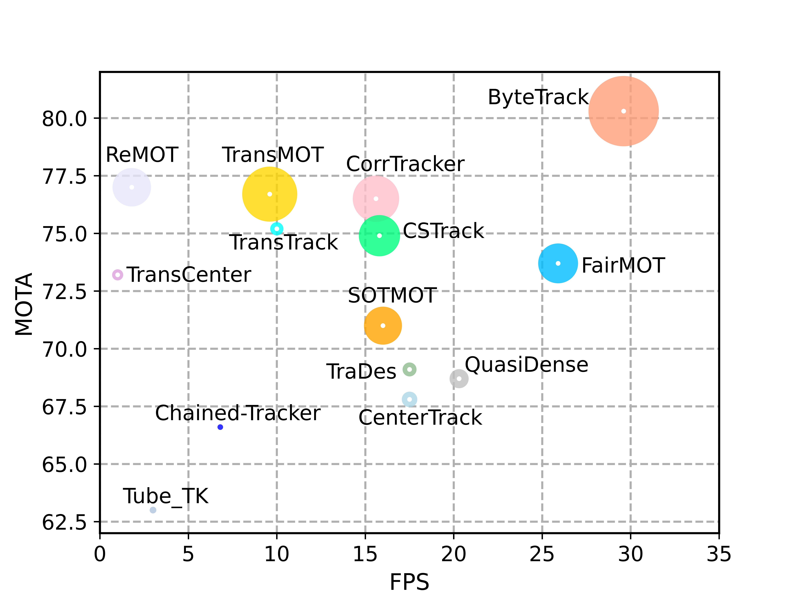
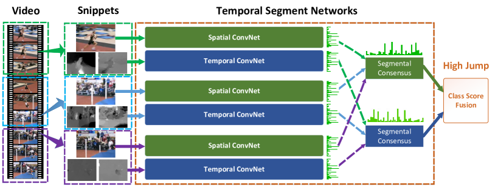

# 模块2：情感计算之人体行为识别 — 基础知识

---

## 目录

1. [什么是人体行为识别（HAR）](#1-什么是人体行为识别har)
2. [YOLO 目标检测](#2-yolo-目标检测)
3. [ByteTrack 多目标跟踪](#3-bytetrack-多目标跟踪)
4. [人体姿态估计](#4-人体姿态估计)
5. [室内行为识别：姿态规则引擎](#5-室内行为识别姿态规则引擎)
6. [MMAction2 与 TSN 时序行为识别](#6-mmaction2-与-tsn-时序行为识别)
7. [Kinetics-400 数据集](#7-kinetics-400-数据集)
8. [RESTful API 与接口规范](#8-restful-api-与接口规范)
9. [FastAPI Web 框架](#9-fastapi-web-框架)
10. [Web 前端基础](#10-web-前端基础)

---

## 1. 什么是人体行为识别（HAR）

### 1.1 定义

**人体行为识别**（Human Action Recognition, HAR）是计算机视觉领域的核心技术之一，旨在通过分析图像或视频中的人体动作、姿态和运动模式，自动识别出人类正在执行的行为类别。它是情感计算（Affective Computing）向行为层面延伸的关键能力——从"理解面部表情"走向"理解身体语言"。

### 1.2 技术范畴

HAR 属于以下领域的交叉：

```
┌──────────────────────────────────────────────────────────┐
│                      情感计算                              │
│               (Affective Computing)                       │
│    ┌────────────────┐    ┌──────────────────┐            │
│    │   人脸表情识别    │    │   人体行为识别      │            │
│    │    (FER)        │    │    (HAR)          │            │
│    └──────┬─────────┘    └──────┬───────────┘            │
│           │                      │                         │
│    ┌──────┴──────────────────────┴───────────┐            │
│    │     计算机视觉  +  深度学习  +  时序分析    │            │
│    └──────────────────────────────────────────┘            │
└──────────────────────────────────────────────────────────┘
```

### 1.3 HAR 的基本流程

一个完整的 HAR 系统通常包含以下步骤：

```
输入视频/图像
    │
    ▼
[人体检测]          ← YOLO 定位画面中所有人
    │
    ▼
[多目标跟踪]        ← ByteTrack 给每人分配唯一 ID
    │
    ▼
┌───────────┬───────────┐
│  室内场景   │  室外场景   │
│  姿态估计   │  时序分类   │
│  YOLO-Pose │  MMAction2 │
│  17点骨架  │  TSN 模型  │
│  规则推断   │  400 类标签 │
└───────────┴───────────┘
    │
    ▼
[行为识别]          ← 规则引擎 或 深度学习模型
    │
    ▼
[结果输出]          ← 标注视频 / JSON / 行为统计 / Web UI
```

### 1.4 HAR 的应用场景

| 场景 | 应用示例 |
|:---|:---|
| **智慧教育** | 课堂行为分析：听讲、举手、写字、低头等状态监测 |
| **智慧安防** | 异常行为检测：跌倒、打架、奔跑、聚集等事件预警 |
| **体育分析** | 运动员动作识别与技术评估（Kinetics-400 覆盖大量体育动作） |
| **人机交互** | 手势识别、体感游戏、AR/VR 中的自然交互 |
| **医疗康复** | 患者运动功能评估、康复训练进度监测 |
| **自动驾驶** | 行人意图预测（是否要过马路、奔跑等） |


*图：人体行为识别完整流水线。从输入视频/图像开始，经 YOLO 人体检测 → ByteTrack 多目标跟踪 → 根据场景分两路（室内：姿态规则引擎 6 类行为；室外：MMAction2 TSN 400 类行为），最终输出标注视频和 JSON 结果。*

### 1.5 HAR 的发展历程

| 阶段 | 年代 | 主要方法 | 代表性工作 |
|:---|:---|:---|:---|
| 萌芽期 | 1990s~2000s | 手工特征（HOG、HOF、MBH）+ 传统分类器 | DT（Dense Trajectories） |
| 双流期 | 2014~2017 | Two-Stream CNN（RGB + 光流） | Two-Stream、TSN |
| 3D卷积期 | 2017~2020 | 3D CNN（C3D、I3D）时序建模 | I3D、SlowFast |
| Transformer期 | 2020~至今 | Video Transformer、多模态融合 | TimeSformer、VideoMAE |

> **本课程聚焦**：使用 YOLOv8 + ByteTrack + MMAction2 TSN 构建**可部署的实时推理系统**，而非追求学术榜单最高精度。

---

## 2. YOLO 目标检测

### 2.1 什么是 YOLO

**YOLO**（You Only Look Once）是一种**单阶段（One-Stage）目标检测算法**，由 Joseph Redmon 等人于 2016 年提出。其核心理念是：**将目标检测视为回归问题，只需"看一次"图像就能同时预测物体的位置和类别**。

### 2.2 YOLO 系列演进

| 版本 | 年代 | 发布者 | 核心创新 | 参数量 |
|:---|:---|:---|:---|:---|
| YOLOv1 | 2016 | Redmon et al. | 端到端统一检测框架 | — |
| YOLOv2 | 2017 | Redmon & Farhadi | Anchor Box + BatchNorm + 多尺度训练 | — |
| YOLOv3 | 2018 | Redmon & Farhadi | FPN 多尺度预测 + Darknet-53 | ~62M |
| YOLOv5 | 2020 | Ultralytics | PyTorch 生态 + 工程优化 | ~7M (nano) |
| **YOLOv8** | **2023** | **Ultralytics** | **无 Anchor 检测 + 解耦头 + C2f 模块** | **~3.2M (nano)** ✅ |
| YOLOv11 | 2024 | Ultralytics | C3k2 模块 + 进一步轻量化 | ~2.6M (nano) |

> 本课程使用 **YOLOv8n**（nano 版本），参数量仅 ~3.2M，在 CPU 上即可实时运行。


*图：YOLOv8 整体网络架构，展示了 Backbone → Neck → Head 三阶段设计。图片来源：Ultralytics 官方文档*

### 2.3 YOLOv8 核心设计

#### 无 Anchor（Anchor-Free）检测

```
传统 Anchor-Based：                         YOLOv8 Anchor-Free：
                                                   
预定义 9 种先验框（anchor）                   直接从特征图预测
需要手动设计 anchor 尺寸                      每个位置预测 bbox 的 (x, y, w, h)
NMS 后处理复杂                               解耦的分类头 + 回归头
                                                   
优势：                                             优势：
  小物体检测较好                                   简化设计
                                                   无需手动调参
                                                  泛化能力更强
```

#### 解耦头（Decoupled Head）

```python
# YOLOv8 的检测头将分类和回归分离
# 分类分支：预测每个位置属于哪个类别
cls_out = cls_conv(features)      # → [B, num_classes, H, W]

# 回归分支：预测 bbox 的坐标偏移
reg_out = reg_conv(features)      # → [B, 4, H, W]
```

> 解耦设计让分类和回归各自学习最合适的特征，避免了耦合头的"冲突梯度"问题。

### 2.4 YOLO-Pose：姿态估计变体

**YOLOv8n-pose** 是在 YOLOv8n 基础上扩展的姿态估计模型，在检测人体的同时输出 **17 个 COCO 关键点**坐标。

```
YOLOv8n 输出：                      YOLOv8n-pose 输出：
  检测框 (x1, y1, x2, y2)           检测框 (x1, y1, x2, y2)
  检测置信度                         检测置信度
  类别标签                            17 个关键点 × (x, y, confidence)
                                     = 51 个附加值
```

**本课程用途**：
- 室内场景：`yolov8n-pose.pt`（检测 + 姿态 → 规则推断行为）
- 室外场景：`yolov8n.pt`（仅检测 + 跟踪 → MMAction2 推理行为）

### 2.5 YOLO 关键参数

| 参数 | 含义 | 本课程值 |
|:---|:---|:---|
| `conf` | 检测置信度阈值，低于此值的检测结果被丢弃 | `0.25` |
| `iou` | NMS 的 IoU 阈值，高于此值认为重叠 | `0.45` |
| `imgsz` | 输入图像尺寸，越大精度越高但越慢 | `640` |
| `device` | 推理设备 | `cpu` |

---

## 3. ByteTrack 多目标跟踪

### 3.1 什么是多目标跟踪（MOT）

**多目标跟踪**（Multi-Object Tracking, MOT）的任务是：在视频的连续帧中，**检测并持续跟踪**多个目标，为每个目标分配一个**唯一且稳定的 ID**。

```
帧 1: [检测到 a, b 两人]  →  a→ID1, b→ID2
帧 2: [检测到 a, c 两人]  →  哪个是 ID1？哪个是新目标？
帧 3: [检测到 a, b, c 三人] →  需要保持 ID1/ID2 并分配 ID3
```

### 3.2 ByteTrack 核心原理

**ByteTrack**（Zhang et al., 2022）是一种轻量级多目标跟踪算法。核心创新是 **BYTE 关联策略**——不仅仅关联高分检测框，而是**充分利用低分检测框**来减少身份切换（ID Switch）和漏跟。

```
传统 Mot：
  检测结果 → 过滤低分 (≤0.5) → 仅用高分框匹配
  问题：遮挡、运动模糊时检测分数骤降 → 丢失目标

ByteTrack (BYTE 策略)：
  检测结果
    ├─ 高分框 (conf > 0.5) → 优先与已有 track 匹配
    └─ 低分框 (0.1 < conf ≤ 0.5) → 与未匹配的高分框进行二次匹配
  优势：被遮挡的人虽然检测分数低，但仍被关联到正确的 track
```

#### 匹配流程

```
① 已有 track 用卡尔曼滤波预测下一帧位置
② 高分检测框 (D_high) 与所有 track 做 IoU 匹配
    匹配成功 → 更新 track 位置
③ 低分检测框 (D_low) 与 ② 中未匹配的 track 做 IoU 匹配
    匹配成功 → 更新 track 位置（捞回被遮挡目标）
④ 仍未匹配的高分框 → 创建新 track（新人进入画面）
⑤ 连续 N 帧未匹配的 track → 删除（已离开画面）
```



*图：ByteTrack 在 MOT17 数据集上的跟踪效果。不同颜色代表不同 ID，通过 BYTE 策略在遮挡和快速移动场景下保持稳定的身份标识。图片来源：ByteTrack 论文 (Zhang et al., ECCV 2022)*

### 3.3 ByteTrack 在本课程中的使用

Ultralytics YOLOv8 内置了对 ByteTrack 的支持，只需在调用 `model.track()` 时指定 tracker 配置文件即可：

```python
results = model.track(
    frame,
    persist=True,                    # 跨帧保持跟踪 ID
    tracker="bytetrack.yaml",        # 使用 ByteTrack
    conf=0.25,
    iou=0.45,
)
```

> `persist=True` 是关键参数：它让 ByteTrack 跨帧保持同一个人的 ID，确保从进入画面到离开画面的整个过程使用相同的标识。

### 3.4 跟踪在行为识别中的关键作用

| 作用 | 说明 |
|:---|:---|
| **身份保持** | 同一人始终用同一 ID，避免"同一个人在不同帧被当作不同人" |
| **时序行为聚合** | 基于 track ID 收集每个人的连续行为标签，构建有意义的行为**片段（segment）** |
| **行为统计** | 统计每个 ID 在视频中各类行为的持续时间和占比 |
| **多人区分** | 每个人的骨架线用不同颜色绘制，可视化清晰 |

---

## 4. 人体姿态估计

### 4.1 什么是人体姿态估计

**人体姿态估计**（Human Pose Estimation）是计算机视觉中的关键任务：给定包含人体的图像，**定位人体关键点（关节）的位置**，并推断人体姿态。

### 4.2 COCO 17 关键点体系

COCO（Common Objects in Context）数据集定义了标准的 17 个人体关键点：

```
 0: nose           (鼻子)
 1: left_eye       (左眼)         2: right_eye       (右眼)
 3: left_ear       (左耳)         4: right_ear       (右耳)
 5: left_shoulder  (左肩)         6: right_shoulder  (右肩)
 7: left_elbow     (左肘)         8: right_elbow     (右肘)
 9: left_wrist     (左腕)        10: right_wrist     (右腕)
11: left_hip       (左髋)        12: right_hip       (右髋)
13: left_knee      (左膝)        14: right_knee      (右膝)
15: left_ankle     (左踝)        16: right_ankle     (右踝)
```

**每个关键点的数据格式**：`[x, y, confidence]`，置信度表示该点被检测到的可靠程度。

### 4.3 骨架连接定义

将这 17 个点按人体结构连接，形成骨架图：

```python
SKELETON = [
    (0, 1), (0, 2), (1, 3), (2, 4),   # 面部：鼻↔眼↔耳
    (5, 6),                             # 双肩
    (5, 7), (7, 9),                     # 左臂：肩→肘→腕
    (6, 8), (8, 10),                    # 右臂：肩→肘→腕
    (5, 11), (6, 12), (11, 12),        # 躯干：肩↔髋
    (11, 13), (13, 15),                # 左腿：髋→膝→踝
    (12, 14), (14, 16),                # 右腿：髋→膝→踝
]
```

```
        0 (鼻子)
       / \
     1     2 (眼睛)
     |     |
     3     4 (耳朵)
      \   /
        5───6 (肩膀)
       /|   |\
      7 |   8 (肘)
      | 11─12 |
      9 |   | 10 (手腕)
       13  14 (膝)
       |   |
       15 16 (踝)
```


*图：COCO 格式定义的 17 个人体关键点及骨架连接。0-鼻子、1-左眼、2-右眼、3-左耳、4-右耳、5-左肩、6-右肩、7-左肘、8-右肘、9-左腕、10-右腕、11-左髋、12-右髋、13-左膝、14-右膝、15-左踝、16-右踝。*

### 4.4 关键点在行为识别中的应用

| 关键点 | 行为判断用途 |
|:---|:---|
| 5, 6（双肩） | **基准线**：判断其他部位是否高于/低于肩膀 |
| 7, 8, 9, 10（肘+腕） | **举手判断**：手腕 Y 坐标 < 肩膀 Y 坐标 → 举手 |
| 0（鼻子） | **低头判断**：鼻子 Y 坐标 > 肩膀 Y 坐标 → 低头 |
| 11, 12（双髋） | **站立判断**：双髋距离 → 躯干长度估算，判定坐/站 |
| 13, 14, 15, 16（膝+踝） | 辅助确认身体姿态 |

### 4.5 置信度阈值

仅当关键点的置信度 `> 0.3` 时，该点才被视为"可见"并参与行为判断。这避免了因遮挡或模型误差导致的错误推断。

---

## 5. 室内行为识别：姿态规则引擎

### 5.1 什么是规则引擎

**规则引擎**是一种**不依赖大量训练数据**的行为识别方法。它通过分析人体关键点的几何关系，基于预定义的 if-else 逻辑来推断行为类别。

**核心理念**：利用人体解剖学常识，通过关键点之间的空间关系（高度、距离、角度）判断当前行为。

```
规则引擎 vs 深度学习：

规则引擎                          深度学习
  ├─ 不需要训练数据                  ├─ 需要大量标注数据
  ├─ 即时可用                        ├─ 需要训练时间
  ├─ 推理速度极快（毫秒级）          ├─ 推理需要 GPU
  ├─ 结果可解释（明确知道为何判断）    ├─ 黑盒决策
  ├─ 规则少时准确率高                ├─ 复杂场景泛化好
  └─ 适合明确的姿势-行为映射         └─ 适合模糊、多样的行为
```

> **本课程的选择**：室内课堂行为（举手、写字、听讲）与人体关键点的几何关系**明确且稳定**，规则引擎是最优解。室外复杂场景则交给 MMAction2 深度学习模型。

### 5.2 六类室内行为

| 行为 | 英文 | 关键特征 |
|:---|:---|:---|
| **sit_listen** | 坐着听课 | 躯干短（坐姿），无特殊姿势，默认状态 |
| **raise_hand** | 举手 | 手腕 Y 坐标明显高于同侧肩膀 Y 坐标 |
| **write** | 写字 | 躯干较长（坐姿偏前倾），手腕低于肩膀 |
| **bow_head** | 低头 | 鼻子 Y 坐标明显低于肩膀 Y 坐标 |
| **stand** | 站立 | 躯干较长（站立），无明显写字/举手特征 |
| **unknown** | 未知 | 双肩不可见或姿态无法判断 |

### 5.3 优先级判断链

行为判断遵循**从特殊到一般**的优先级链：

```
输入关键点 kpts (17, 3)
    │
    ▼
步骤1：双肩不可见？ → unknown（置信度 0.3）
    │ 可见
    ▼
步骤2：手腕高于肩膀 30px？ → raise_hand（置信度 0.75）
    │ 否
    ▼
步骤3：躯干长度 > 120px（站立/前倾状态）？
    ├─ 是 → 手腕在写字位置？ → write（置信度 0.65）
    │       否 → stand（置信度 0.6）
    │ 否（坐姿状态）
    ▼
步骤4：鼻子低于肩膀 20px？ → bow_head（置信度 0.6）
    │ 否
    ▼
步骤5：默认 → sit_listen（置信度 0.55）
```

> **设计思想**：
> - 举手是最明确的信号（手腕明显高于肩），优先级最高
> - 站立/写字的区分取决于手腕位置：手腕下垂在身前 → 写字；手腕自然垂下 → 站立
> - 低头通过鼻子-肩膀的 Y 轴偏移判断
> - 如果前四个条件都不满足，默认为"坐着听课"


*图：基于人体关键点几何关系的室内行为规则引擎示意图。通过手腕-肩膀高度差判举手，躯干长度判坐/站，鼻子-肩膀偏移判低头，其余姿态默认为听讲。*

### 5.4 关键参数说明

| 参数 | 值 | 含义 |
|:---|:---|:---|
| 手腕-肩阈值 | `30px` | 手腕比肩膀高 30 像素以上才算举手（640×480 分辨率下） |
| 躯干长度阈值 | `120px` | 髋-肩距离超过 120 像素判定为站立/写字状态 |
| 鼻-肩阈值 | `20px` | 鼻子比肩膀低 20 像素以上判为低头 |
| 置信度：举手 | `0.75` | 高置信度（信号强） |
| 置信度：写字 | `0.65` | 较高置信度 |
| 置信度：站立 | `0.60` | 中等置信度 |
| 置信度：低头 | `0.60` | 中等置信度 |
| 置信度：听讲 | `0.55` | 默认置信度 |
| 置信度：未知 | `0.30` | 低置信度 |

### 5.5 行为片段聚合

逐帧推断会产生大量离散的行为标签。**行为片段聚合**（Segment Building）将这些标签组织成有时序意义的连续片段：

```
逐帧结果（平滑前）：
sit → sit → raise → sit → sit → sit → write → write
     ↑ 单帧跳变（噪声）

滑动窗口平滑（k=3）：
sit → sit → raise → raise → sit → sit → write → write
     ↑ 用前两帧的多数派修正

连续同行为合并 → Segments：
Segment 1: sit_listen  (帧 0→1,  0.0~0.07s)
Segment 2: raise_hand  (帧 2→3,  0.07~0.13s)
Segment 3: sit_listen  (帧 4→5,  0.13~0.2s)
Segment 4: write       (帧 6→7,  0.2~0.27s)
```

**每个 Segment 包含**：
- 行为标签 + 平均置信度
- 起始/结束帧号 + 时间戳
- 持续秒数
- 平均检测置信度

### 5.6 规则引擎的优缺点

| 优点 | 缺点 |
|:---|:---|
| 零训练数据需求 | 仅适用于行为-姿态映射明确的场景 |
| 推理速度极快（纯 NumPy 运算） | 无法处理非标准姿态（如单手托腮写字） |
| 结果可解释性强 | 规则阈值依赖分辨率和摄像头角度 |
| 易于调试和修改 | 规则数量多时维护困难 |
| 适合结构化场景（课堂、办公室） | 无法推广到复杂/户外场景 |

---

## 6. MMAction2 与 TSN 时序行为识别

### 6.1 什么是 MMAction2

**MMAction2** 是 OpenMMLab 开源的**视频理解工具箱**，基于 PyTorch 构建，覆盖了动作识别、时序动作定位、时空动作检测等任务。它提供了统一的模型训练/推理框架和丰富的预训练模型，是学术界和工业界视频行为分析的主流工具之一。

### 6.2 TSN（Temporal Segment Network）

**TSN**（Temporal Segment Networks）是 Wang 等人于 2016 年提出的经典视频行为识别架构。核心思想是：**将长视频均匀分割为多个片段（segment），从每个片段中采样少量帧，分别用 CNN 提取空间特征，最后融合所有片段的预测结果**。

#### TSN 工作流程

```
完整视频（例如 300 帧）
    │
    ▼
均匀分割为 K=3 个片段
    │
    ├─ Segment 1 (帧 0~99)   → 随机采样 1 帧 → CNN → 预测1
    ├─ Segment 2 (帧 100~199) → 随机采样 1 帧 → CNN → 预测2
    └─ Segment 3 (帧 200~299) → 随机采样 1 帧 → CNN → 预测3
    │
    ▼
    融合（平均/投票）→ 最终预测
```



*图：Temporal Segment Networks (TSN) 架构图。将视频均匀分为多个片段，每段稀疏采样极少量帧，经共享 CNN 分别提取特征后融合输出。图片来源：TSN 论文 (Wang et al., ECCV 2016)*

**核心优势**：
- 用极少的帧（K × 1 帧）建模长视频的时序结构
- 每个片段独立处理，计算效率高
- 对视频长度不敏感（通过均匀分段适应任意时长）

#### TSN vs 3D CNN

| 特性 | TSN | 3D CNN (如 C3D、I3D) |
|:---|:---|:---|
| **建模方式** | 稀疏采样 + 2D CNN 聚合 | 密集 3D 卷积 |
| **计算量** | 低（K × 单帧推理） | 高（连续帧立方体卷积） |
| **长视频处理** | 天然支持 | 受限于显存 |
| **GPU 需求** | 低（CPU 可推理） | 高 |
| **适用场景** | 实时推理、CPU 部署 | 离线高精度分析 |

> 本课程使用 TSN + ResNet-50 主干（ImageNet 预训练），在 CPU 上即可完成 Kinetics-400 的 400 类行为识别。

### 6.3 本课程中的 MMAction2 推理管线

#### 快速推理管线

```python
_FAST_TEST_PIPELINE = [
    dict(type='DecordInit'),                                              # 视频解码器初始化
    dict(type='SampleFrames', clip_len=1, frame_interval=1, num_clips=3), # 采样 3 个片段 × 1 帧
    dict(type='DecordDecode'),                                            # 解码帧
    dict(type='Resize', scale=(-1, 256)),                                # 短边缩放到 256
    dict(type='CenterCrop', crop_size=224),                              # 中心裁剪 224×224
    dict(type='FormatShape', input_format='NCHW'),                       # 格式转换
    dict(type='PackActionInputs'),                                        # 打包为模型输入
]
```

> 原版 TSN 使用 TenCrop × 25 segments = 250 帧，极慢。快速管线将采样数降为 3 clips × 1 frame = 3 帧，大幅提速。

#### 推理流程

```
video_path（MP4 文件）
    │
    ▼
inference_recognizer(model, video_path)
    │
    ├─ DecordInit → 打开视频
    ├─ SampleFrames → 采样 3 帧
    ├─ DecordDecode → 解码为 RGB 图像
    ├─ Resize + CenterCrop → 224×224
    ├─ TSN Network (ResNet-50) → 每帧提取特征
    ├─ 聚合 → 分类得分 (400 维)
    └─ Softmax → 取 Top-1 → 行为标签 + 置信度
    │
    ▼
输出: { "behavior": "dancing ballet", "score": 0.85 }
```

### 6.4 两种推理模式

| 模式 | `scene`（默认） | `track` |
|:---|:---|:---|
| 做法 | 对整个画面进行行为推理 | 裁剪每个人体区域单独推理 |
| 优点 | 全局上下文信息更丰富 | 多人场景每个人独立识别 |
| 缺点 | 多人不同行为时只能输出一个标签 | 速度更慢，每个人的裁剪区域可能信息不足 |
| CPU 性能 | 较好 | 较差 |

### 6.5 推理间隔与预热机制

#### 推理间隔 `infer_interval`

```python
infer_interval = 48              # 每 48 帧调用一次 MMAction2 推理
# 30fps 视频 = 每 1.6 秒推理一次
# 相邻推理之间的帧复用上一次的推理结果
```

> **设计原因**：MMAction2 的推理相对耗时（单次约 200~500ms），不能逐帧调用。间隔 48 帧在行为变化不频繁的室外场景中足够实用。

#### `_bootstrap_scene()` 预热

```
问题：infer_interval=48，视频前 47 帧 behavior = unknown

解决：启动时对整段视频先做一次 MMAction2 推理
     → 获得初始 scene_behavior
     → 第 0 帧开始就有正确的行为标签
```

### 6.6 MMAction2 在本课程中的角色

| 特性 | 说明 |
|:---|:---|
| **模型** | TSN + ResNet-50 主干 |
| **预训练** | ImageNet 预训练 + Kinetics-400 微调 |
| **推理权重** | `tsn_imagenet-pretrained-r50_...pth` |
| **覆盖行为** | Kinetics-400 的 400 类（体育、日常、社交等） |
| **推理设备** | CPU（通过快速管线优化） |
| **标签映射** | `label_map_k400.txt`（索引 → 英文行为名称） |

---

## 7. Kinetics-400 数据集

### 7.1 数据集概述

**Kinetics-400** 是由 DeepMind 于 2017 年发布的大规模视频行为识别数据集。它是当前视频理解领域的"ImageNet"——几乎所有视频行为识别模型都使用它进行预训练或评估。

### 7.2 基本信息

| 属性 | 值 |
|:---|:---|
| **全名** | Kinetics-400 Human Action Video Dataset |
| **发布者** | DeepMind (Google) |
| **发布年代** | 2017 |
| **行为类别数** | **400 类** |
| **视频总数** | ~306,000 段 |
| **每段时长** | ~10 秒（短视频片段） |
| **视频来源** | YouTube 公开视频 |
| **标注方式** | 人工标注 |

### 7.3 行为类别示例

Kinetics-400 覆盖了广泛的人类行为：

| 类别 | 示例行为 |
|:---|:---|
| **体育运动** | `playing basketball`, `swimming`, `surfing`, `skiing`, `skateboarding`, `archery` |
| **乐器演奏** | `playing guitar`, `playing piano`, `playing violin`, `playing drums` |
| **日常活动** | `cooking`, `eating`, `brushing teeth`, `washing dishes`, `reading` |
| **舞蹈** | `dancing ballet`, `belly dancing`, `breakdancing`, `tango` |
| **社交互动** | `shaking hands`, `hugging`, `kissing`, `high fiving` |
| **手工制作** | `knitting`, `painting`, `woodworking`, `sewing` |
| **竞技格斗** | `boxing`, `wrestling`, `judo`, `fencing` |


*图：Kinetics-400 数据集概况。覆盖 400 类人类行为，包含 ~306,000 段约 10 秒的 YouTube 视频片段，涵盖体育、乐器、日常活动、舞蹈、社交等广泛类别。*

### 7.4 数据特点

**优点**：
- 类别极其丰富（400 类），覆盖广泛
- 视频来自真实 YouTube 场景（in-the-wild）
- 学术界广泛使用，预训练模型质量高

**挑战**：
- 视频质量和拍摄角度参差不齐
- 部分类别区分度小（如多种舞蹈类别）
- 每段仅约 10 秒，是"短视频片段"而非完整视频

### 7.5 在本课程中的使用方式

```
本课程的数据获取方式：

  ┌──────────────────────────────────────┐
  │  不下载 Kinetics-400 原始数据集        │
  │  ↓                                   │
  │  直接使用预训练好的 TSN 推理权重        │
  │  (tsn_imagenet-pretrained-r50_...pth)  │
  │  ↓                                   │
  │  + label_map_k400.txt 标签映射文件     │
  │  ↓                                   │
  │  即可对任意视频进行 400 类行为推断      │
  └──────────────────────────────────────┘
```

> 本课程聚焦**推理部署**，不涉及 Kinetics-400 的训练过程。推理权重已提供，开箱即用。

---

## 8. RESTful API 与接口规范

### 8.1 什么是 RESTful API

**REST**（Representational State Transfer，表述性状态转移）是一种 Web 服务架构风格，由 Roy Fielding 于 2000 年在博士论文中提出。RESTful API 是遵循 REST 原则设计的 Web API。

### 8.2 REST 核心原则

| 原则 | 描述 | 示例 |
|:---|:---|:---|
| **资源（Resource）** | 一切皆资源，用 URI 标识 | `/api/v1/jobs/{id}` → 分析任务资源 |
| **无状态（Stateless）** | 每个请求包含处理所需的全部信息 | 不依赖服务端 Session |
| **统一接口（Uniform Interface）** | 使用标准 HTTP 方法操作资源 | GET/POST/DELETE |
| **表述（Representation）** | 资源可以有多种表述形式 | JSON |
| **分层系统（Layered）** | 客户端不需要知道是否直连服务器 | 可加负载均衡、缓存层 |

### 8.3 HTTP 方法与 CRUD 映射

| HTTP 方法 | CRUD | 操作 | 示例（本 HAR 项目） |
|:---|:---|:---|:---|
| **GET** | Read | 读取资源 | `GET /api/v1/health` — 健康检查 |
| **POST** | Create | 创建资源 | `POST /api/v1/behavior/analyze` — 上传文件分析 |
| **DELETE** | Delete | 删除资源 | `DELETE /api/v1/jobs/{id}` — 删除任务 |

### 8.4 本 HAR 项目的 API 设计

```
┌──────────────────────────────────────────────────────────┐
│                   HAR 行为识别 API 服务                     │
│                  http://localhost:8082                     │
├──────────────────────────────────────────────────────────┤
│                                                           │
│  GET    /api/v1/health              → 健康检查             │
│  GET    /api/v1/behaviors           → 行为标签列表          │
│  GET    /api/v1/demo-samples        → 内置 demo 列表       │
│  GET    /api/v1/demo-samples/{id}/preview → demo 预览图    │
│  POST   /api/v1/behavior/analyze-demo → 一键分析 demo      │
│  POST   /api/v1/behavior/analyze    → 上传文件分析（核心）   │
│  GET    /api/v1/jobs                → 任务列表             │
│  GET    /api/v1/jobs/{id}           → 任务详情 + 结果      │
│  GET    /api/v1/jobs/{id}/result    → 完整 JSON 结果       │
│  GET    /api/v1/media/{id}/original → 原始媒体文件          │
│  GET    /api/v1/media/{id}/annotated → 标注图片/视频        │
│  GET    /api/v1/media/{id}/keyframes/... → 关键帧          │
│  DELETE /api/v1/jobs/{id}           → 删除任务             │
│                                                           │
└──────────────────────────────────────────────────────────┘
```


*图：HAR 系统的 API 架构总览。Web 前端/外部客户端通过 HTTP 请求调用 FastAPI 服务器，后者调度推理引擎（YOLOv8 + ByteTrack + Pose + MMAction2）并将结果以 JSON 格式返回。*

### 8.5 状态码规范

| 状态码 | 含义 | 本 HAR 项目使用场景 |
|:---|:---|:---|
| **200 OK** | 请求成功 | 成功获取结果、健康检查通过 |
| **400 Bad Request** | 客户端请求错误 | 缺少必要参数、文件格式不支持 |
| **404 Not Found** | 资源不存在 | 请求的任务/文件不存在 |
| **413 Payload Too Large** | 文件过大 | 上传文件超过限制 |
| **422 Unprocessable Entity** | 参数校验失败 | 室外场景上传了图片 |
| **500 Internal Server Error** | 服务器内部错误 | 模型推理异常 |

### 8.6 响应格式示例

```json
// POST /api/v1/behavior/analyze — 分析成功
{
  "job_id": "a1b2c3d4-...",
  "status": "completed",
  "summary": {
    "scene": "classroom",
    "person_count": 5,
    "behavior_segment_counts": {
      "sit_listen": 12,
      "raise_hand": 3,
      "write": 5,
      "bow_head": 2,
      "stand": 1
    }
  },
  "media_urls": {
    "original": "/api/v1/media/a1b2c3d4/original",
    "annotated": "/api/v1/media/a1b2c3d4/annotated"
  }
}

// 错误响应
{
  "detail": "室外场景仅支持视频分析，请上传视频文件"
}
```

---

## 9. FastAPI Web 框架

### 9.1 什么是 FastAPI

**FastAPI** 是一个现代的、高性能的 Python Web 框架，用于构建 API。它基于 Python 3.6+ 的类型提示（Type Hints），由 Sebastián Ramírez 开发。

**核心设计理念**：
- **快速**：性能媲美 Node.js 和 Go（基于 Starlette 和 Pydantic）
- **自动文档**：自动生成 Swagger UI 和 ReDoc 交互式 API 文档
- **类型安全**：基于 Python 类型提示，IDE 自动补全和类型检查
- **简洁**：代码量少，直观易用


*图：FastAPI 框架官方标志。FastAPI 是基于 Starlette 和 Pydantic 的现代 Python Web 框架，以高性能、自动 API 文档和类型安全为设计理念。图片来源：fastapi.tiangolo.com*

### 9.2 FastAPI 入门案例

#### 最小 FastAPI 应用

```python
from fastapi import FastAPI

app = FastAPI()

@app.get("/")
def root():
    return {"message": "Hello, HAR!"}
```

```powershell
uvicorn main:app --host 0.0.0.0 --port 8082
# 访问 http://localhost:8082 → {"message": "Hello, HAR!"}
# 访问 http://localhost:8082/docs → Swagger UI 交互文档
```

#### 带请求体的分析接口示例

```python
from fastapi import FastAPI, UploadFile, File, Form
from fastapi.responses import JSONResponse

app = FastAPI()

@app.post("/api/v1/behavior/analyze")
async def analyze(
    file: UploadFile = File(...),           # 上传的图片/视频
    scene: str = Form("classroom"),         # classroom 或 extracurricular
    max_frames: int = Form(None),           # 最大处理帧数
):
    """上传图片/视频进行行为分析"""
    # 校验文件类型
    allowed = {".jpg", ".jpeg", ".png", ".bmp", ".webp", ".mp4", ".avi", ".mov"}
    ext = "." + file.filename.rsplit(".", 1)[-1].lower()
    if ext not in allowed:
        return JSONResponse(
            {"detail": f"不支持的文件格式: {ext}"},
            status_code=400,
        )

    # 室外场景禁止图片
    if scene == "extracurricular" and ext in {".jpg", ".jpeg", ".png"}:
        return JSONResponse(
            {"detail": "室外场景仅支持视频分析"},
            status_code=422,
        )

    # 保存文件 + 调用推理流水线 ...
    return {"job_id": "...", "status": "running"}
```

### 9.3 FastAPI vs Flask

| 特性 | FastAPI | Flask |
|:---|:---|:---|
| 异步支持 | ✅ 原生 `async/await` | ❌ 需额外插件 |
| 自动文档 | ✅ Swagger + ReDoc | ❌ 需手动或用插件 |
| 数据验证 | ✅ Pydantic 类型验证 | ❌ 手动或 WTForms |
| 性能 | 高（异步 + Starlette） | 中等（同步 WSGI） |
| 学习曲线 | 中等 | 低 |
| 生态成熟度 | 较新但快速增长 | 成熟稳定 |

> **为什么 HAR 项目选 FastAPI？** 行为分析是**计算密集型**异步任务（分析一个大视频可能需要几十秒），FastAPI 的原生异步支持和后台任务管理更适合这个场景。自动生成的 `/docs` 页面也让 API 联调更加方便。

### 9.4 任务管理设计

HAR 分析是耗时操作（视频分析可能需要数分钟），不能阻塞 HTTP 响应。因此使用**异步任务管理**模式：

```
POST /api/v1/behavior/analyze
    │
    ├─ 创建 job_id（UUID）
    ├─ 保存上传文件到 data/api/uploads/{job_id}/
    ├─[立即返回]→ { "job_id": "...", "status": "pending" }
    │
    └─ 后台线程池执行推理
         ├─ status → "running"（更新进度信息）
         ├─ run_analysis(scene, input, output, ...)
         └─ status → "completed"（存入结果）

前端轮询：
    GET /api/v1/jobs/{id}  → 查询状态 + 进度
    当 status == "completed" → 获取结果 + 播放标注视频
```

> `max_workers=1`：单线程顺序推理，避免两个模型同时运行导致 CPU 过载。

### 9.5 静态文件挂载

FastAPI 可以直接挂载前端静态文件目录，实现前后端一体化部署：

```python
from fastapi.staticfiles import StaticFiles
from fastapi.responses import FileResponse

if WEB_DIR.exists():
    app.mount("/assets", StaticFiles(directory=WEB_DIR), name="assets")

    @app.get("/")
    def index():
        return FileResponse(WEB_DIR / "index.html")
```

---

## 10. Web 前端基础

### 10.1 前端技术栈

本 HAR 项目的前端使用纯 HTML + CSS + JavaScript（零框架依赖），追求**简单、轻量、直接可用**。

| 技术 | 作用 |
|:---|:---|
| **HTML5** | 页面结构：标题、卡片、上传区、结果展示 |
| **CSS3** | 样式：Flexbox 布局、响应式设计、动画过渡 |
| **JavaScript (Vanilla)** | 交互逻辑：文件上传、API 调用、结果渲染、视频播放 |

### 10.2 页面模块

```
┌──────────────────────────────────────────┐
│  Header：标题 + API 健康状态指示灯         │
├──────────────────────────────────────────┤
│  快速试用：3 个 Demo 卡片                  │
│  ┌─────────┐ ┌─────────┐ ┌────────────┐  │
│  │室内视频  │ │室内图片  │ │室外 sports │  │
│  └─────────┘ └─────────┘ └────────────┘  │
├──────────────────────────────────────────┤
│  上传区域：拖拽或点击选择文件               │
├──────────────────────────────────────────┤
│  场景选择：○ classroom  ○ extracurricular │
│  参数：最大帧数 / 可视化 / 关键帧          │
│  [开始分析]                                │
├──────────────────────────────────────────┤
│  结果展示：摘要 + 行为统计 + 标注视频       │
└──────────────────────────────────────────┘
```


*图：HAR 行为识别系统 Web 前端界面截图。包含 Demo 快速试用、文件上传、场景选择和结果展示等核心功能模块。*

### 10.3 关键交互逻辑

#### 文件上传处理

```javascript
// 使用 FormData 发送 multipart/form-data 请求
const formData = new FormData();
formData.append("file", fileInput.files[0]);
formData.append("scene", selectedScene);
formData.append("max_frames", maxFrames);

const response = await fetch("/api/v1/behavior/analyze", {
    method: "POST",
    body: formData,
});
```

#### 结果轮询

```javascript
// 任务提交后，定时轮询任务状态
async function pollJob(jobId) {
    const poll = setInterval(async () => {
        const resp = await fetch(`/api/v1/jobs/${jobId}`);
        const job = await resp.json();

        updateProgress(job.progress_message);

        if (job.status === "completed") {
            clearInterval(poll);
            showResults(job);
        } else if (job.status === "failed") {
            clearInterval(poll);
            showError(job.error);
        }
    }, 1000);  // 每秒轮询一次
}
```

#### 场景联动

```javascript
// 室外场景仅支持视频 → 选图片时禁用提交按钮
sceneRadios.forEach(radio => {
    radio.addEventListener("change", () => {
        if (selectedScene === "extracurricular" && fileIsImage) {
            submitBtn.disabled = true;
            showHint("室外场景仅支持视频分析");
        }
    });
});
```

### 10.4 支持的媒体格式

| 类型 | 格式 | 场景 |
|:---|:---|:---|
| **图片** | `.jpg`, `.jpeg`, `.png`, `.bmp`, `.webp` | 仅室内 |
| **视频** | `.mp4`, `.avi`, `.mov`, `.mkv`, `.webm` | 室内 + 室外 |

### 10.5 Demo 快速试用

前端提供 3 个内置 Demo，无需上传文件即可一键体验：

| ID | 名称 | 场景 | 媒体文件 |
|:---|:---|:---|:---|
| `classroom_video` | 室内视频 | classroom | `classroom01_clip_8min_1min.mp4` |
| `classroom_image` | 室内图片 | classroom | `classroom01_frame_00000.jpg` |
| `extracurricular_video` | 室外视频 | extracurricular | `sports.mp4` |

---

<!-- edu-oss-embedded:2082034938915696641,2082034939226075137,2082034939599368194,2082034939871997954,2082034940144627713,2082034940446617602,2082034940710858754,2082034940975099906,2082034941239341058,2082034941600051201 -->
